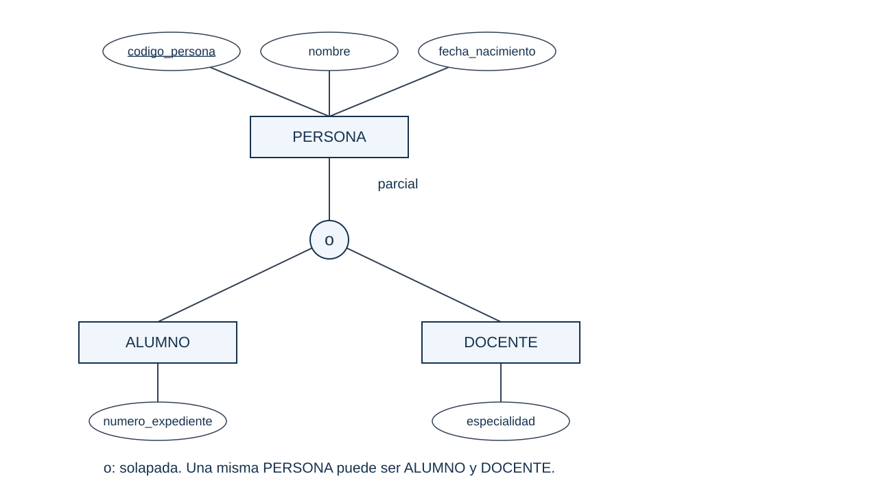
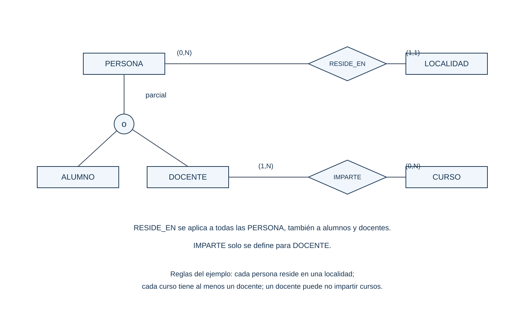
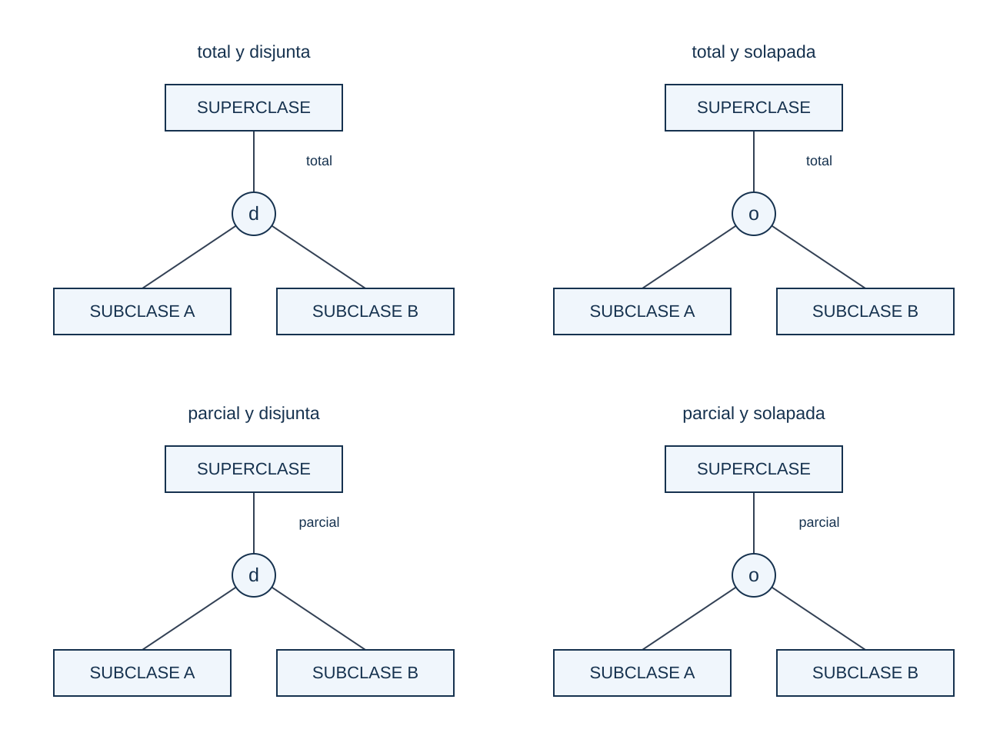
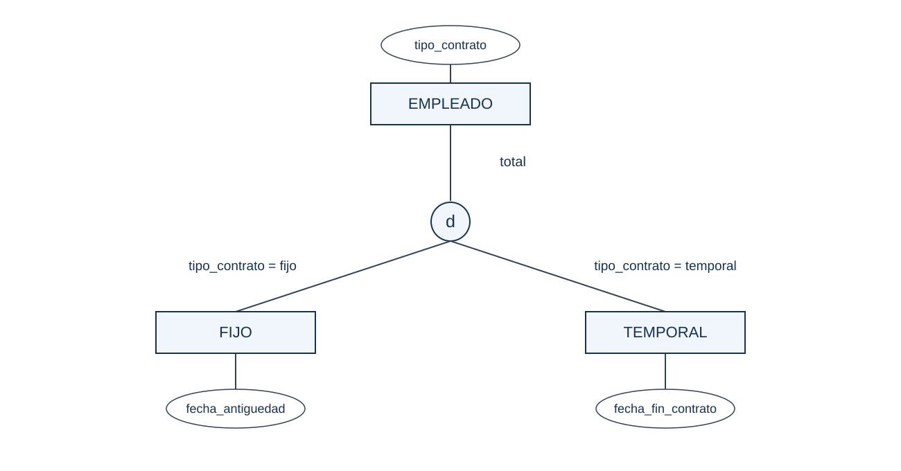
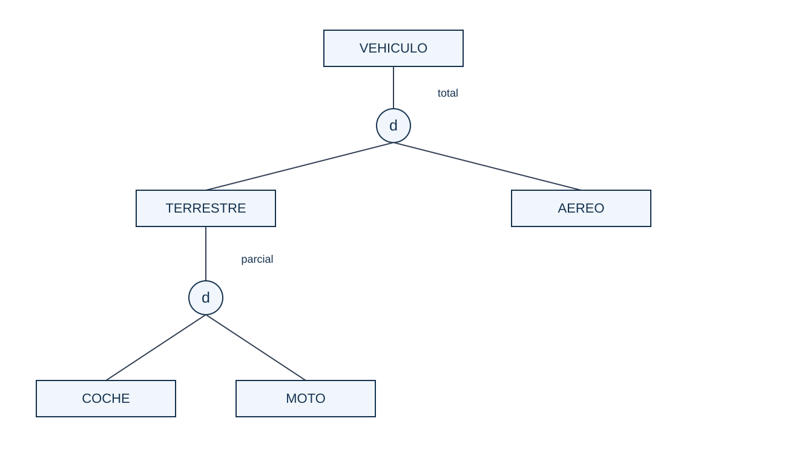
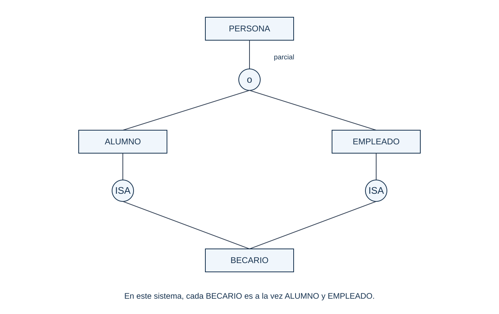
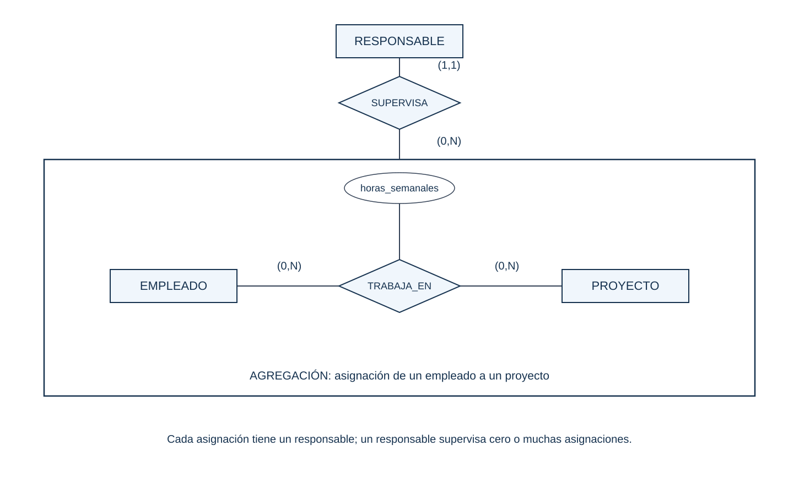
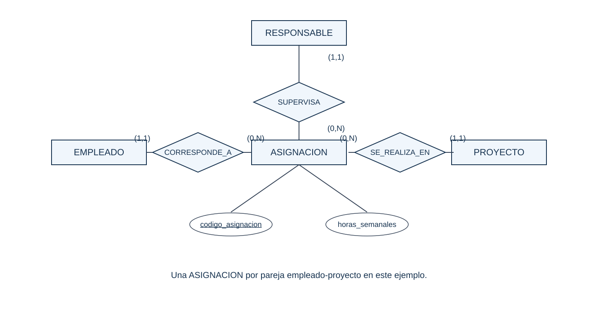

# Modelo E/R extendido: notación de Chen

**Bases de Datos · 1.º DAM · Continuación del tema de diseño conceptual**

Estos apuntes desarrollan los apartados 10 a 13 mediante **diagramas conceptuales**. Las entidades se representan con rectángulos, las relaciones con rombos y los atributos con óvalos. No estamos creando tablas ni indicando claves foráneas.

## Convención utilizada en los diagramas

El modelo E/R extendido no tiene una única notación gráfica universal. Aquí utilizamos **Chen para entidades, relaciones y atributos**, ampliada con círculos para representar las especializaciones.

| Elemento | Representación en estos apuntes |
|---|---|
| Entidad | Rectángulo |
| Relación ordinaria | Rombo |
| Atributo | Óvalo |
| Identificador | Nombre del atributo subrayado |
| Especialización o generalización | Círculo entre superclase y subclases |
| Subclases disjuntas | `d` dentro del círculo |
| Subclases solapadas | `o` dentro del círculo |
| Completitud | Palabra `total` o `parcial` junto al tramo de la superclase |
| Herencia múltiple | Una misma subclase conectada a varias superclases |
| Agregación | Contorno que agrupa una relación y sus entidades participantes |

**Todas las conexiones son simples.** Para evitar confundir símbolos, escribimos `total` o `parcial` en las especializaciones. En las relaciones ordinarias utilizamos pares **(mínimo,máximo)**.

**Lectura de cardinalidades usada en clase:** junto a cada entidad se indica cuántas ocurrencias de **esa entidad** corresponden a una ocurrencia del extremo contrario. Por ejemplo, si una persona reside en una localidad, `(1,1)` se coloca junto a LOCALIDAD. Si una localidad puede tener cero o muchas personas, `(0,N)` se coloca junto a PERSONA.

> Las conexiones de herencia no son relaciones binarias ordinarias. No se les asignan automáticamente cardinalidades `(1,1)` o `(0,N)`: se describen mediante completitud y solapamiento.

## 10. Modelo E/R extendido

El modelo E/R extendido incorpora mecanismos para representar reglas más complejas. Permite describir tipos generales y tipos específicos, compartir propiedades por herencia y expresar restricciones sobre la pertenencia a esos tipos.

### 10.1. Superclase y subclase

- **Superclase:** tipo de entidad general que contiene atributos y relaciones comunes.
- **Subclase:** subconjunto de ocurrencias de la superclase con atributos, relaciones o restricciones específicos.

Toda ocurrencia de una subclase **es también una ocurrencia de la superclase**. Por ejemplo, una persona que pertenece a ALUMNO sigue siendo una PERSONA; no estamos representando dos individuos distintos.

Las subclases **heredan los atributos, el identificador y las relaciones** de la superclase.

#### Ejemplo: PERSONA, ALUMNO y DOCENTE

En una academia se registran personas con código, nombre y fecha de nacimiento. Algunas son alumnos y otras son docentes. De los alumnos interesa su número de expediente; de los docentes, su especialidad. Puede haber personas que todavía no tengan ninguno de esos papeles y una persona puede desempeñar ambos simultáneamente.

**Cómo leerlo:**

1. PERSONA reúne la información común: `codigo_persona`, `nombre` y `fecha_nacimiento`.
2. ALUMNO incorpora `numero_expediente` y hereda los datos de PERSONA.
3. DOCENTE incorpora `especialidad` y hereda los datos de PERSONA.
4. El círculo conecta los tipos específicos con el general. Cada alumno y cada docente **es una persona**.
5. `parcial` permite personas sin ninguno de esos papeles.
6. `o` permite que una persona sea alumna y docente a la vez.

**¿Por qué no repetimos el identificador en las subclases?** Porque se hereda. Una persona mantiene su identidad al ser alumna, docente o ambas. No se crea un nuevo individuo por cada papel.

**¿Por qué no dibujamos un rombo «ES_UNA»?** Porque queremos expresar inclusión entre tipos e herencia de propiedades, no una asociación entre objetos independientes.

#### Herencia de relaciones

Supongamos que cada persona reside en una localidad y que cada curso tiene al menos un docente. Un docente puede no impartir cursos todavía y una localidad puede no tener personas registradas.

- RESIDE_EN se define para PERSONA: también se aplica a sus alumnos y docentes. No se repite para cada subclase.
- IMPARTE se define específicamente para DOCENTE: ser ALUMNO no permite participar en esa relación solo por pertenecer a PERSONA.
- `(1,N)` junto a DOCENTE significa que un curso tiene uno o muchos docentes.
- `(0,N)` junto a CURSO significa que un docente puede impartir cero o muchos cursos.

**Cuándo crear subclases:** cuando los tipos específicos aportan atributos, relaciones o restricciones relevantes. Si solo queremos guardar una etiqueta sin otras diferencias, un atributo `tipo` podría ser suficiente.

### 10.2. Especialización y generalización

**Especialización:** partimos de una superclase y definimos subclases según sus diferencias. Razonamos de lo general a lo específico.

Ejemplo: partimos de PERSONA y detectamos que ALUMNO necesita un expediente y DOCENTE necesita una especialidad.

**Generalización:** partimos de varios tipos semejantes y reunimos sus características comunes en una superclase. Razonamos de lo específico a lo general.

Ejemplo: inicialmente tenemos ALUMNO y DOCENTE con código, nombre y fecha de nacimiento. Extraemos esa información común y proponemos PERSONA.

El resultado gráfico puede ser el mismo. Cambia **cómo llegamos al modelo**, no necesariamente su estructura final.

### 10.3. Restricción de completitud

La completitud responde a esta pregunta:

> ¿Toda ocurrencia de la superclase debe pertenecer a alguna de las subclases representadas?

- **Total:** toda ocurrencia pertenece al menos a una subclase.
- **Parcial:** pueden existir ocurrencias que no pertenezcan a ninguna.

**Ejemplo total:** el sistema solo registra personas que son alumnas, docentes o ambas. No admite a una persona sin ninguno de esos papeles.

**Ejemplo parcial:** se registra a una persona interesada en la academia antes de matricularla o contratarla. Puede existir como PERSONA sin ser todavía ALUMNO ni DOCENTE.

En nuestros diagramas se escribe **total** o **parcial** junto a la conexión entre la superclase y el círculo. No confundas esta restricción con el carácter obligatorio de una relación ordinaria.

### 10.4. Restricción de solapamiento

El solapamiento responde a otra pregunta:

> ¿Una misma ocurrencia puede pertenecer simultáneamente a más de una de estas subclases?

- **Disjunta:** pertenece como máximo a una subclase de esa especialización. Se escribe `d` en el círculo.
- **Solapada:** puede pertenecer a varias simultáneamente. Se escribe `o` en el círculo.

Si una persona puede ser alumna y docente a la vez, la especialización es **solapada**. Si las reglas del sistema prohíben combinar esos papeles, es **disjunta**.

La restricción depende del enunciado, no de que en los datos actuales haya o no alguien con ambos papeles.

#### Completitud y solapamiento son independientes

| Combinación | Número de subclases de esa especialización a las que puede pertenecer una ocurrencia |
|---|---|
| Total y disjunta | Exactamente una |
| Total y solapada | Al menos una; puede pertenecer a varias |
| Parcial y disjunta | Ninguna o una |
| Parcial y solapada | Ninguna, una o varias |

**Cómo decidirlo sin adivinar:**

1. Pregunta si se admite una ocurrencia sin ninguna subclase. Si se admite, es parcial; si no, total.
2. Pregunta si se admite una ocurrencia en dos subclases a la vez. Si se admite, es solapada; si no, disjunta.
3. Anota las dos decisiones en el dibujo y compruébalas con ejemplos.

> PERSONA con ALUMNO y DOCENTE será **parcial y solapada** si se admiten personas sin ambos papeles y también personas con los dos papeles.

### 10.5. Discriminador

Un **discriminador** es un atributo o una condición que determina la pertenencia a una subclase.

En este ejemplo simplificado, cada empleado tiene un `tipo_contrato` con exactamente uno de dos valores: `fijo` o `temporal`. Un empleado FIJO tiene fecha de antigüedad y un TEMPORAL tiene fecha de fin de contrato.

- Si `tipo_contrato = fijo`, pertenece a FIJO.
- Si `tipo_contrato = temporal`, pertenece a TEMPORAL.
- La especialización es total: todos los empleados tienen uno de esos tipos.
- Es disjunta: en este minimundo no pueden tener ambos valores a la vez.

Un único atributo monovaluado no basta siempre para decidir pertenencias solapadas. En PERSONA, una etiqueta exclusiva `alumno` o `docente` no permitiría representar a alguien con ambos papeles. Se necesitan condiciones compatibles con esa posibilidad.

No se inventa un discriminador automáticamente: puede haber pertenencia definida por condiciones o asignada explícitamente por el sistema.

### 10.6. Jerarquías y retículas

#### Jerarquía

Una subclase puede especializarse de nuevo. La estructura resultante forma una jerarquía cuando cada subclase tiene una única superclase directa.

En este catálogo simplificado, cada VEHICULO es TERRESTRE o AEREO. Algunos terrestres son COCHE o MOTO, pero también se permiten otros terrestres sin clasificar en esos dos tipos.

- La primera especialización es total y disjunta.
- La especialización de TERRESTRE es parcial y disjunta.
- COCHE hereda lo común de TERRESTRE y, a través de este, lo común de VEHICULO.

Cada nivel tiene **sus propias restricciones**: que el primero sea total no obliga a que el siguiente lo sea.

#### Retícula y herencia múltiple

Cuando una subclase tiene varias superclases directas aparece una **retícula** con herencia múltiple conceptual.

En el siguiente sistema, BECARIO designa a una persona que es a la vez ALUMNO y EMPLEADO. Puede haber alumnos y empleados que no sean becarios.

Los círculos con `ISA` se leen «es un tipo de». No son relaciones ordinarias. Las dos conexiones de BECARIO indican que debe pertenecer a **ambas superclases**, no que puede elegir entre ellas.

- Todo BECARIO es ALUMNO y EMPLEADO.
- No todo ALUMNO ni todo EMPLEADO es BECARIO.
- Ser a la vez alumno y empleado no implica por sí solo ser becario: debe cumplirse la regla de pertenencia establecida.
- La identidad procede de la PERSONA común.

La herencia múltiple debe usarse con cuidado: hay que revisar que atributos, identificadores y restricciones heredados sean compatibles.

## 11. Agregación

La **agregación** permite tratar una relación, junto con sus participantes, como una unidad conceptual que puede participar en otra relación.

### 11.1. Ejemplo: supervisar una asignación

Un EMPLEADO trabaja en un PROYECTO. De ese vínculo se conservan las horas semanales asignadas. Un RESPONSABLE supervisa **esa asignación concreta**, no al empleado o al proyecto de forma aislada.

En este ejemplo:

- Un empleado puede trabajar en cero o muchos proyectos.
- Un proyecto puede tener cero o muchos empleados.
- Se registra una asignación por pareja empleado-proyecto.
- Cada asignación tiene exactamente un responsable.
- Un responsable puede no supervisar ninguna asignación o supervisar muchas.

**Cómo leer el dibujo:**

1. EMPLEADO y PROYECTO se conectan mediante TRABAJA_EN.
2. `horas_semanales` sale del rombo porque describe el trabajo de un empleado en un proyecto concreto.
3. Un contorno encierra EMPLEADO, TRABAJA_EN y PROYECTO, con el atributo de la relación.
4. Ese conjunto representa las asignaciones concretas existentes.
5. SUPERVISA conecta RESPONSABLE con la unidad agregada.
6. `(1,1)` junto a RESPONSABLE significa que una asignación tiene un responsable.
7. `(0,N)` junto al extremo de la agregación significa que un responsable supervisa cero o muchas asignaciones.

**¿Por qué no dibujamos solo RESPONSABLE supervisa EMPLEADO?** Porque el mismo empleado podría tener un responsable distinto según el proyecto.

**¿Por qué no basta RESPONSABLE supervisa PROYECTO?** Porque ese dato no distingue las asignaciones de empleados concretos dentro del proyecto.

### 11.2. Diferencia con una entidad asociativa

También podemos representar la asignación como una **entidad asociativa ASIGNACION**, con identificador propio y horas semanales. Se vincula obligatoriamente con un empleado, un proyecto y un responsable.

En esta alternativa hay un rectángulo ASIGNACION: el vínculo se trata como una entidad. En la agregación anterior, el contorno agrupa la relación original con sus participantes. **No son el mismo símbolo**, aunque en este caso pueden expresar las mismas reglas si mantenemos una asignación por pareja empleado-proyecto.

El identificador `codigo_asignacion` no elimina esa restricción de unicidad. Antes de usar una agregación, comprueba si una entidad asociativa comunica el dominio con más claridad.

### 11.3. No confundir conceptos

| Concepto | Idea principal | Ejemplo |
|---|---|---|
| Subclase | Una ocurrencia es también del tipo general | Un DOCENTE es una PERSONA |
| Entidad débil | Necesita otra entidad para completar su identificación | Una construcción se identifica dentro de su mundo |
| Entidad asociativa | Una asociación se trata como entidad | VERSION representa juego-consola |
| Agregación | Una relación y sus participantes se tratan como unidad | Un responsable supervisa una asignación empleado-proyecto |

Tener atributos propios no convierte automáticamente una relación en entidad asociativa; depender de otra entidad tampoco convierte automáticamente una entidad en débil por identificación.

## 12. Restricciones semánticas

Las cardinalidades y la herencia no expresan todas las reglas posibles. Ejemplos:

- Un empleado no puede supervisarse a sí mismo.
- La fecha de fin debe ser posterior a la fecha de inicio.
- Una persona menor de edad necesita representante.
- La suma de porcentajes de dedicación no puede superar el 100 %.
- Un aula no puede albergar dos sesiones simultáneas.
- Un módulo debe ser impartido por personal con una determinada acreditación.

Estas reglas deben documentarse aunque no se puedan expresar completamente mediante los símbolos del diagrama.

| Código | Regla | Elementos afectados | Momento de validación |
|---|---|---|---|
| RN-01 | Una edición termina después de comenzar | EDICION | Alta y modificación |
| RN-02 | Una persona no se matricula dos veces en la misma edición | MATRICULA | Alta |
| RN-03 | Una persona no puede supervisarse a sí misma | EMPLEADO y SUPERVISA | Alta y modificación |
| RN-04 | Toda persona que sea becaria debe ser alumna y empleada | PERSONA, ALUMNO, EMPLEADO y BECARIO | Alta y cambio de pertenencia |

Las reglas RN-01 a RN-03 corresponden a sus respectivos ejemplos de negocio. No deben añadirse como requisitos implícitos a todos los diagramas anteriores.

> Si una regla no aparece en el diagrama, en el glosario o en el catálogo de restricciones, probablemente se perderá durante la implementación.

## 13. Cómo construir un modelo conceptual

### 13.1. Comprender y delimitar el problema

Identifica el objetivo del sistema, los datos necesarios y las reglas. Los sustantivos ofrecen candidatos a entidades; los verbos, candidatos a relaciones. No deben convertirse automáticamente en elementos del diagrama.

Un glosario evita usar palabras distintas para el mismo concepto o una misma palabra con significados diferentes:

| Término | Significado en el sistema | Ejemplo |
|---|---|---|
| Curso | Oferta formativa estable | Introducción a las bases de datos |
| Edición | Realización de un curso en fechas concretas | Edición de octubre |
| Matrícula | Inscripción de una persona en una edición | Matrícula de Ana en la edición de octubre |

### 13.2. Proponer la estructura: procedimiento de clase

**Antes de dibujar:** marca posibles entidades y relaciones en el enunciado. Si aparece una clasificación, comprueba si expresa «es un tipo de» o una asociación ordinaria.

1. **Proponer las frases del problema.** Separa asociaciones, atributos y restricciones. Ejemplo: «Una persona puede ser alumna y docente a la vez» expresa solapamiento.
2. **Generar modelos parciales.** Dibuja rectángulos, rombos y, cuando proceda, especializaciones. Une cada atributo mediante un óvalo al concepto que describe.
3. **Estudiar cardinalidades y restricciones.** En relaciones ordinarias pregunta por mínimos y máximos en ambos sentidos. En especializaciones pregunta por completitud y solapamiento; no sustituyas estas preguntas por cardinalidades binarias.
4. **Integrar el modelo completo.** Reutiliza las entidades compartidas. Una subclase hereda las relaciones de su superclase; no las dibujes repetidas sin una razón del dominio.
5. **Colocar atributos e identificadores.** Los comunes van en la superclase y los específicos en sus subclases. El identificador se hereda. Los datos del vínculo van en su relación o entidad asociativa, según el modelo elegido.
6. **Revisar y documentar restricciones.** Anota reglas no expresables con los símbolos y registra las suposiciones necesarias.

Si el enunciado no indica si una persona puede ser alumna y docente simultáneamente, no elijas `d` u `o` sin justificarlo: solicita la información o documenta una suposición.

### 13.3. Comprobar el modelo con casos habituales y límite

| Caso de prueba | Qué debemos comprobar |
|---|---|
| Persona sin ser alumna ni docente | Solo se admite si la especialización es parcial |
| Persona alumna y docente a la vez | Solo se admite si la especialización es solapada |
| Alumno sin pertenecer a PERSONA | Nunca se admite: el subtipo está incluido en el supertipo |
| Curso sin ediciones | Depende del mínimo de la relación curso-edición |
| Matrícula sin alumno | Se rechaza si toda matrícula exige alumno |
| Dos matrículas de una persona en una edición | Se rechazan si el sistema establece una única matrícula por pareja |
| Responsable distinto para cada proyecto de un mismo empleado | Debe poder representarse si se supervisa la asignación concreta |

Para cada caso, pregunta si debe admitirse y comprueba si el dibujo expresa esa decisión. Lee finalmente el modelo como frases y contrástalo con alguien que conozca el sistema.

### Resumen para recordar

- **Es un tipo de** orienta hacia especialización o generalización.
- **Es obligatorio clasificarse** orienta hacia total; **puede no clasificarse**, hacia parcial.
- **Solo un subtipo** orienta hacia disjunta; **varios simultáneos**, hacia solapada.
- **Se hereda** lo común; no se crean identificadores nuevos por cada papel sin justificación.
- **Se relaciona una asignación concreta con otra entidad** puede justificar agregación o una entidad asociativa.
- El dibujo sigue siendo **conceptual**: rectángulos, rombos y óvalos, no tablas del modelo relacional.
