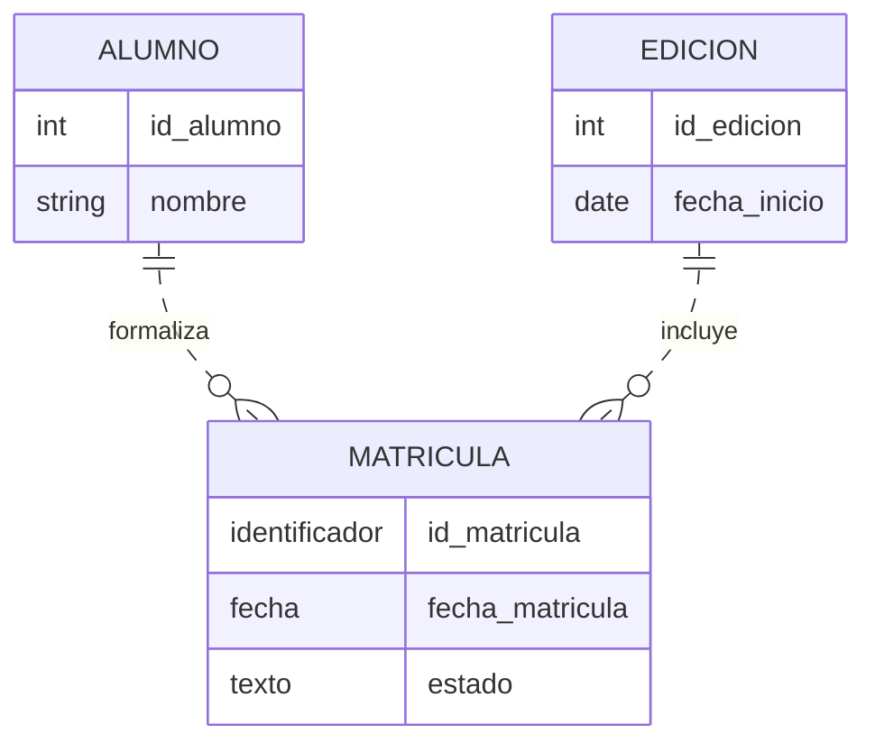
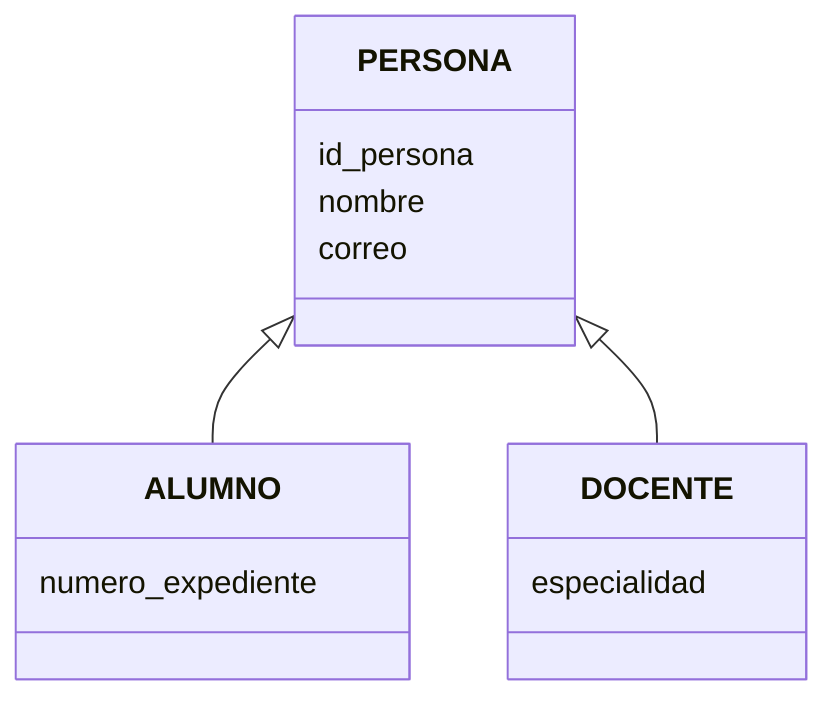
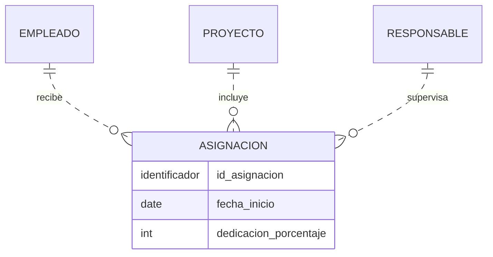
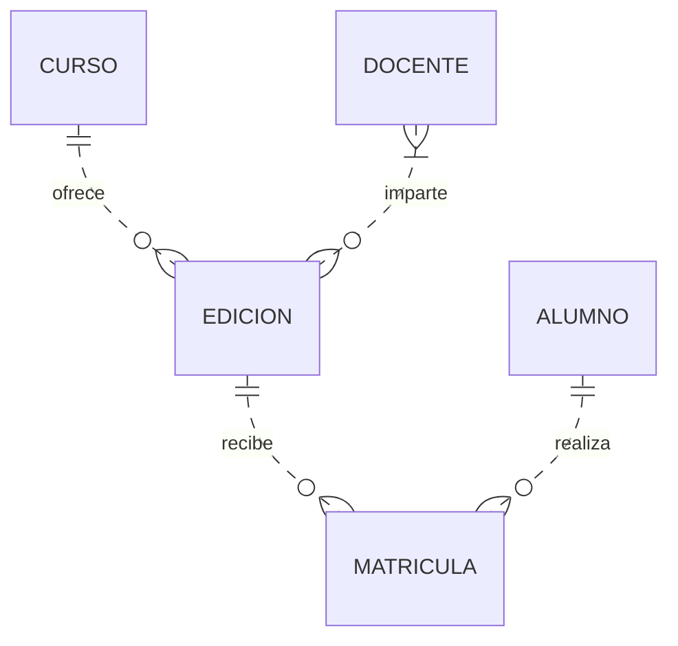

# Tema 2. Diseño conceptual: modelo entidad/relación

En la unidad anterior estudiamos cómo se almacena la información y para qué sirven los sistemas gestores. Antes de construir una base de datos, necesitamos decidir qué información representa el problema y qué reglas debe cumplir.

El diseño conceptual permite expresar esas decisiones mediante entidades, atributos y relaciones. En este tema aprenderemos a interpretar sus elementos y a construir modelos comprensibles, acompañados de ejemplos y reglas escritas.

## Índice

- [1. Antes de dibujar: comprender el problema](#apartado-1)
- [2. El modelo entidad/relación](#apartado-2)
- [3. Entidades](#apartado-3)
- [4. Atributos](#apartado-4)
- [5. Identificadores y claves](#apartado-5)
- [6. Relaciones](#apartado-6)
- [7. Cardinalidad y participación](#apartado-7)
- [8. Entidades fuertes y débiles](#apartado-8)
- [9. Entidades asociativas](#apartado-9)
- [10. Modelo E/R extendido](#apartado-10)
- [11. Agregación](#apartado-11)
- [12. Restricciones semánticas](#apartado-12)
- [13. Cómo construir un modelo conceptual](#apartado-13)
- [14. Errores frecuentes](#apartado-14)
- [15. Ejemplo resuelto: una academia](#apartado-15)
- [16. Resumen](#apartado-16)

## 1. Antes de dibujar: comprender el problema

Diseñar una base de datos no empieza creando tablas. Empieza comprendiendo una realidad concreta, denominada a veces **universo del discurso** o **minimundo**.

Supongamos que una academia nos dice:

> La academia ofrece cursos. Cada curso puede abrir varias ediciones a lo largo del año. El alumnado se matricula en una edición concreta. De cada matrícula se conserva la fecha y el estado.

Antes de elegir símbolos debemos resolver preguntas:

- ¿Curso y edición son el mismo concepto?
- ¿Puede existir un curso sin ediciones?
- ¿Puede abrirse una edición sin curso?
- ¿Puede una persona matricularse dos veces en la misma edición?
- ¿Qué estados puede tener una matrícula?

Un buen diagrama no elimina estas preguntas: nos obliga a descubrirlas y contestarlas.

> Un modelo es una representación simplificada de una realidad para un propósito. No intenta almacenar todo lo que sabemos, sino lo necesario para resolver el problema.

### 1.1. Fases del diseño

1. **Recogida y análisis de requisitos:** entender datos, operaciones y reglas.
2. **Diseño conceptual:** representar el dominio sin depender de un SGBD concreto.
3. **Diseño lógico:** transformar el modelo conceptual al modelo elegido, por ejemplo, el relacional.
4. **Diseño físico:** decidir estructuras de almacenamiento, índices, particiones y otros detalles del SGBD.

En este tema trabajaremos principalmente el **diseño conceptual**. La transformación a tablas y la normalización se estudiarán en temas posteriores.

### 1.2. Modelo, esquema e instancia

- **Modelo de datos:** conjunto de conceptos y reglas que usamos para representar información.
- **Esquema:** descripción concreta de la estructura de un sistema, por ejemplo, el diagrama de una academia.
- **Instancia o estado:** datos existentes en un momento determinado.

El esquema indica que `ALUMNO` tiene `correo`; una instancia concreta indica que el correo de Ana es `ana@example.test`.

## 2. El modelo entidad/relación

El modelo entidad/relación, o **modelo E/R**, representa la estructura conceptual de un dominio mediante:

- **tipos de entidad**;
- **atributos**;
- **tipos de relación**;
- **restricciones**.

Existen varias notaciones para representar un modelo E/R. La de **Chen** utiliza rectángulos para las entidades, óvalos para los atributos y rombos para las relaciones. La de **pata de cuervo** expresa las cardinalidades mediante marcas en los extremos de las líneas.

En las explicaciones indicaremos siempre los valores **(mínimo, máximo)**. Los diagramas de relaciones incluidos en este archivo utilizan pata de cuervo mediante Mermaid. La herencia se ilustra con un esquema diferente, identificado en su apartado.

> Herramientas distintas pueden usar símbolos diferentes, como Chen, pata de cuervo o UML. La notación cambia; la regla de negocio representada debería ser la misma.

### 2.1. Símbolos de la notación de Chen

| Elemento | Representación habitual |
|---|---|
| Entidad fuerte | Rectángulo |
| Relación | Rombo |
| Atributo | Óvalo |
| Atributo identificador | Nombre subrayado |
| Atributo multivaluado | Óvalo doble |
| Atributo derivado | Óvalo con trazo discontinuo |
| Atributo compuesto | Óvalo conectado a los óvalos de sus componentes |
| Entidad débil | Rectángulo doble |
| Relación identificadora | Rombo doble |

Estas convenciones permiten leer diagramas de Chen. No deben confundirse con las cajas y marcas de pata de cuervo utilizadas en los diagramas de este archivo.

## 3. Entidades

Una **entidad** es algo del dominio con existencia propia sobre lo que necesitamos conservar información. Puede ser:

- físico: una persona, un vehículo o un ejemplar;
- conceptual: un curso, una cuenta o un departamento;
- un suceso relevante: una reserva, una matrícula o una inspección.

### 3.1. Tipo de entidad y ocurrencia

No debemos confundir:

- **tipo de entidad:** la definición general, como `ALUMNO`;
- **ocurrencia de entidad:** un alumno concreto;
- **conjunto de entidades:** todas las ocurrencias de un tipo existentes en un momento dado.

En el diagrama se representan **tipos**, no cada objeto individual.

> **Ejemplo:** `PRODUCTO` es un tipo de entidad. El teclado con identificador 101 es una ocurrencia. El conjunto de productos disponibles hoy constituye un conjunto de ocurrencias. En el diagrama aparece `PRODUCTO`, no un rectángulo para cada teclado.

### 3.2. Cómo nombrarlas

Usaremos nombres:

- en singular: `ALUMNO`, no `ALUMNOS`;
- mediante sustantivos claros;
- coherentes en todo el modelo;
- propios del dominio, evitando nombres vagos como `DATOS` o `COSAS`.

Usar singular es la convención elegida en estos apuntes; lo importante es mantener nombres claros y coherentes.

### 3.3. ¿Es realmente una entidad?

Un concepto suele merecer ser entidad cuando:

- posee varias ocurrencias distinguibles;
- tiene propiedades propias que necesitamos almacenar;
- participa en relaciones;
- tiene un ciclo de vida relevante para el sistema.

No todas las palabras importantes de un enunciado se convierten en entidades. Antes de decidir, pregunta:

1. ¿Necesitamos almacenar información propia sobre el concepto?
2. ¿Existen varias ocurrencias?
3. ¿Podemos distinguir unas de otras?
4. ¿Tiene sentido relacionarlo con otros conceptos?

Por ejemplo, `dirección` podría ser un atributo compuesto de `CLIENTE` o una entidad independiente si varias personas comparten direcciones, existen distintos tipos de dirección o necesitamos gestionarlas por separado.

## 4. Atributos

Un **atributo** describe una propiedad de una entidad o, en algunos casos, de una relación.

Ejemplos para `PERSONA`: identificador, nombre, fecha de nacimiento y correo electrónico.

### 4.1. Dominio de un atributo

El **dominio** es el conjunto de valores permitidos para un atributo. Incluye aspectos como:

- tipo de valor;
- formato;
- rango;
- unidades;
- valores válidos;
- posibilidad de ausencia.

Decir que `nota` es «un número» es poco preciso. Un dominio mejor sería: número decimal entre 0 y 10, con una cifra decimal.

### 4.2. Atributos simples y compuestos

- **Simple:** no interesa dividirlo en componentes, como `altura_cm`.
- **Compuesto:** contiene partes con significado propio, como `dirección`, formada por vía, número, código postal y localidad.

Que un valor pueda dividirse no obliga a modelarlo como compuesto. Lo hacemos cuando sus componentes son necesarios para consultas o reglas.

### 4.3. Atributos monovaluados y multivaluados

- **Monovaluado:** una ocurrencia tiene como máximo un valor, como la fecha de nacimiento.
- **Multivaluado:** una ocurrencia puede tener varios valores, como varios teléfonos de contacto.

Si necesitamos almacenar información adicional sobre cada valor —tipo de teléfono, prioridad o fecha de verificación— probablemente convenga convertirlo en una entidad relacionada.

### 4.4. Atributos almacenados y derivados

- **Almacenado:** su valor se conserva directamente.
- **Derivado:** se calcula a partir de otros datos.

La edad cambia con el tiempo; normalmente se almacena la fecha de nacimiento y se deriva la edad para una fecha concreta.

No todos los valores calculables deben derivarse siempre. A veces se almacena un resultado por razones legales, históricas o de rendimiento. La decisión debe documentarse.

### 4.5. Atributos opcionales

Un atributo puede no tener valor para determinadas ocurrencias. Hay que distinguir entre:

- valor desconocido;
- valor todavía no disponible;
- valor no aplicable;
- valor deliberadamente no registrado.

Todos podrían terminar representados como ausencia de valor, pero no significan lo mismo para el negocio.

### 4.6. Resumen de tipos de atributos

| Criterio | Posibilidades | Ejemplo |
|---|---|---|
| Estructura | Simple o compuesto | Código de producto / dirección con calle y localidad |
| Cantidad de valores | Monovaluado o multivaluado | Fecha de nacimiento / teléfonos de contacto |
| Obtención | Almacenado o derivado | Fecha de nacimiento / edad calculada |
| Obligatoriedad | Obligatorio u opcional | Identificador / segundo teléfono |

Estas clasificaciones se combinan. Un atributo puede ser simple, monovaluado y obligatorio al mismo tiempo.

Un teléfono o un código postal no debe tratarse automáticamente como una cantidad numérica: puede contener ceros iniciales o símbolos y no se utiliza para hacer sumas. En el modelo conceptual interesa describir su significado y valores admitidos; el tipo concreto del SGBD se decidirá después.

### 4.7. Atributos de una relación

Un atributo pertenece a una relación cuando describe el hecho que vincula las entidades, no a una de ellas por separado.

En «un alumno se matricula en una edición», `fecha_matricula` y `estado` describen esa matrícula.

| Alumno | Edición | Fecha de matrícula | Estado |
|---|---|---|---|
| Ana | BD-octubre | 2026-09-20 | Confirmada |
| Ana | Redes-noviembre | 2026-10-15 | Pendiente |
| Bruno | BD-octubre | 2026-09-22 | Confirmada |

Ana tiene dos fechas porque son dos matrículas distintas. Por eso `fecha_matricula` no describe únicamente al alumno ni únicamente a la edición. Más adelante veremos cómo representar esa asociación mediante `MATRICULA`.

## 5. Identificadores y claves

Un **identificador** es un atributo o conjunto mínimo de atributos cuyos valores distinguen inequívocamente cada ocurrencia de un tipo de entidad.

### 5.1. Conceptos esenciales

- **Superclave:** conjunto de atributos que identifica de forma única, aunque pueda contener atributos innecesarios.
- **Clave candidata:** superclave mínima; si quitamos un atributo deja de identificar.
- **Clave primaria:** clave candidata elegida como identificador principal en el diseño lógico.
- **Clave alternativa:** clave candidata que no fue elegida como primaria.
- **Clave compuesta:** formada por más de un atributo.
- **Clave natural:** procede del dominio, como un código oficial estable.
- **Clave artificial o sustituta:** creada específicamente para identificar, como un número interno.

En diseño conceptual hablaremos preferentemente de **identificadores** o claves candidatas. Las claves foráneas pertenecen al modelo relacional y aparecerán al transformar relaciones en tablas.

> Una clave foránea no es «la clave primaria de otra entidad» dentro del diagrama conceptual. Es un mecanismo del modelo relacional para representar referencias entre tablas.

### 5.2. Ejemplo de claves candidatas

Supongamos que cada producto recibe un `id_producto` y un `codigo_catalogo`, ambos obligatorios y únicos por las reglas del sistema.

| Conjunto de atributos | ¿Identifica? | Interpretación |
|---|---|---|
| `id_producto` | Sí | Clave candidata |
| `codigo_catalogo` | Sí | Otra clave candidata |
| `id_producto` y `nombre` | Sí | Superclave no mínima: el nombre sobra |
| `nombre` | No necesariamente | Dos productos pueden compartir nombre |

**Mínima** no significa «la clave con menos caracteres». Significa que no podemos quitarle un atributo sin perder la capacidad de identificar.

Si el sistema identifica un asiento mediante `sala` y `numero_asiento`, la combinación es un identificador compuesto: el asiento 12 puede existir en varias salas.

### 5.3. Cómo elegir un buen identificador

Debe ser:

- único;
- obligatorio;
- mínimo;
- estable en el tiempo;
- conocido o generable cuando se crea la ocurrencia.

Un nombre no suele ser un buen identificador. Un documento oficial tampoco siempre es adecuado: puede no existir, cambiar, contener errores o estar sujeto a restricciones de privacidad.

## 6. Relaciones

Una **relación** representa una asociación relevante entre ocurrencias de uno o varios tipos de entidad.

Se suele nombrar con un verbo o expresión verbal:

- `ALUMNO se_matricula_en EDICION`;
- `DOCENTE imparte MODULO`;
- `PERSONA supervisa PERSONA`.

La relación debe poder leerse en ambos sentidos y producir frases coherentes.

### 6.1. Grado de una relación

El **grado** describe el número de participantes o papeles de la asociación. En la clasificación introductoria se distinguen:

- **unaria o recursiva:** participa un tipo de entidad;
- **binaria:** participan dos;
- **ternaria:** participan tres;
- **n-aria:** participan n tipos.

### 6.2. Relaciones recursivas y roles

En una relación recursiva, el mismo tipo de entidad participa con papeles distintos. Es obligatorio nombrar los **roles** para evitar ambigüedad.

Ejemplo: una persona empleada puede supervisar a otras personas empleadas.

| Persona en el rol de supervisor | Persona en el rol de supervisado |
|---|---|
| Laura | Ana |
| Laura | Bruno |
| Ana | Carla |

El mismo tipo `EMPLEADO` participa en ambos extremos. Para este ejemplo, cada empleado puede tener cero o un supervisor y puede supervisar a cero o muchos empleados. La prohibición de supervisarse a sí mismo se documenta además como regla.

### 6.3. Relaciones ternarias

Una relación ternaria no debe sustituirse automáticamente por tres relaciones binarias: podrían expresar reglas diferentes.

Ejemplo: un proveedor suministra un producto para un proyecto. El precio acordado puede depender simultáneamente de los tres participantes.

Para comprobar si puede descomponerse, debemos analizar si las relaciones binarias conservan todas las asociaciones permitidas y restricciones del enunciado.

| Proveedor | Producto | Proyecto |
|---|---|---|
| P1 | Teclado | Aula Norte |
| P1 | Ratón | Aula Sur |
| P2 | Teclado | Aula Sur |

Si guardamos solo las parejas proveedor-producto, proveedor-proyecto y producto-proyecto, todas las parejas de `P1 — Teclado — Aula Sur` aparecerían en algún registro. Sin embargo, esa combinación completa no aparece en la tabla original. Las parejas, por sí solas, no conservan toda la información.

> La relación ternaria expresa el hecho conjunto: **qué proveedor suministra qué producto para qué proyecto**.

## 7. Cardinalidad y participación

La cardinalidad indica cuántas ocurrencias de una entidad pueden o deben relacionarse con una ocurrencia concreta de otra entidad.

Usaremos la notación **(mínimo, máximo)**:

- `(0,1)`: participación opcional y como máximo una;
- `(1,1)`: exactamente una;
- `(0,N)`: ninguna, una o muchas;
- `(1,N)`: al menos una y posiblemente muchas.

### 7.1. Cardinalidad máxima

La cardinalidad máxima origina las clasificaciones habituales:

- uno a uno (`1:1`);
- uno a muchos (`1:N`);
- muchos a muchos (`N:M`).

Pero `1:N` no informa de si la participación es obligatoria. Por eso necesitamos también el mínimo.

### 7.2. Participación mínima

- **Parcial u opcional:** mínimo `0`.
- **Total u obligatoria:** mínimo `1`.

Ejemplo:

> Cada edición pertenece exactamente a un curso. Un curso puede no tener todavía ediciones o tener muchas.

- Para una `EDICION`, el número de cursos relacionados es `(1,1)`.
- Para un `CURSO`, el número de ediciones relacionadas es `(0,N)`.

| Punto de partida | Pregunta | Respuesta |
|---|---|---|
| Una edición | ¿A cuántos cursos pertenece? | Exactamente uno: `(1,1)` |
| Un curso | ¿Cuántas ediciones puede tener? | Ninguna o varias: `(0,N)` |

No hay contradicción entre un máximo `N` y un mínimo `0`: podemos permitir muchas ediciones sin exigir que exista alguna desde el momento de registrar el curso.

### 7.3. Método para calcular cardinalidades

No adivines mirando el dibujo. Formula dos preguntas:

1. Para **una** ocurrencia de A, ¿con cuántas ocurrencias de B puede relacionarse como mínimo y como máximo?
2. Para **una** ocurrencia de B, ¿con cuántas ocurrencias de A puede relacionarse como mínimo y como máximo?

Después busca contraejemplos y casos límite.

> Palabras como «cada», «puede», «debe», «solo», «al menos» y «varios» suelen esconder restricciones de cardinalidad.

### 7.4. Ejemplos de cardinalidad máxima

| Relación | Reglas del ejemplo | Máximos |
|---|---|---|
| EMPLEADO tiene TARJETA | Cada empleado tiene como máximo una tarjeta activa; cada tarjeta se asigna como máximo a un empleado | `1:1` |
| CLIENTE realiza PEDIDO | Un cliente puede realizar varios pedidos; cada pedido corresponde a un cliente | `1:N` |
| ALUMNO cursa EDICION | Un alumno puede cursar varias ediciones y una edición puede tener varios alumnos | `N:M` |

La obligatoriedad debe indicarse por separado. Por ejemplo, podemos permitir que un cliente aún no tenga pedidos, pero exigir que cada pedido tenga cliente.

Las cardinalidades proceden de las reglas acordadas, no de los pocos datos disponibles hoy. Que ahora una edición tenga un solo alumno no significa que su máximo sea uno.

### 7.5. Lectura de los diagramas

En pata de cuervo, las marcas situadas junto a una entidad indican cuántas ocurrencias de **esa entidad** corresponden a una ocurrencia de la del extremo contrario. Los símbolos representan cero, uno o muchos y se combinan para expresar mínimos y máximos. Mermaid diferencia además relaciones identificadoras, con línea continua, y no identificadoras, con línea discontinua. [Documentación de Mermaid](https://mermaid.js.org/syntax/entityRelationshipDiagram.html).

En notación de Chen con pares mínimo-máximo, es frecuente colocar junto a cada entidad su participación en la relación. Por ello, no conviene trasladar una etiqueta de un dibujo a otro sin comprobar la convención. En estos apuntes, las frases y tablas indican explícitamente cómo se interpreta cada ejemplo.

## 8. Entidades fuertes y débiles

Una entidad es **fuerte** cuando dispone de un identificador propio independiente.

Una entidad es **débil por identificación** cuando no puede identificarse únicamente mediante sus atributos y necesita:

- su **identificador parcial**;
- el identificador de una entidad propietaria;
- una **relación identificadora** con dicha entidad.

Ejemplo: el número de habitación puede ser único dentro de un hotel, pero no entre todos los hoteles. Una habitación podría identificarse mediante `(hotel, numero_habitacion)`.

| Hotel | Número de habitación | Identificación completa |
|---|---|---|
| H01 | 101 | `(H01, 101)` |
| H01 | 102 | `(H01, 102)` |
| H02 | 101 | `(H02, 101)` |

`numero_habitacion` actúa como identificador parcial: distingue habitaciones dentro del mismo hotel. La habitación 101 de H01 y la 101 de H02 son ocurrencias diferentes.

En notación de Chen se suele representar la entidad débil con un rectángulo doble y la relación identificadora con un rombo doble.

### 8.1. Dependencia de existencia y de identificación

No son exactamente lo mismo:

- **Dependencia de existencia:** una ocurrencia no puede existir sin otra.
- **Dependencia de identificación:** necesita el identificador de otra para ser identificada.

Un pedido puede depender de la existencia de un cliente según las reglas del sistema y, aun así, tener un identificador propio. Por tanto, no sería necesariamente una entidad débil por identificación.

## 9. Entidades asociativas

Una relación `N:M` con atributos propios o con necesidad de participar en otras relaciones suele tratarse como una **entidad asociativa**.

Ejemplo: `MATRICULA` conecta `ALUMNO` y `EDICION`, y posee un identificador propio, fecha y estado. En este ejemplo se permite una sola matrícula por alumno y edición.

Cada matrícula corresponde exactamente a un alumno y a una edición. Un alumno y una edición pueden tener cero o muchas matrículas asociadas, correspondientes a distintas ediciones o distintos alumnos, respectivamente. La unicidad de la pareja alumno-edición se documenta aparte.

La entidad asociativa no se crea «porque toda relación N:M deba ser una entidad» en el nivel conceptual. Se usa cuando el vínculo tiene identidad o significado relevante, atributos propios o debe relacionarse con otros conceptos.

## 10. Modelo E/R extendido

El modelo E/R extendido incorpora mecanismos para representar reglas más complejas.

### 10.1. Superclase y subclase

- **Superclase:** tipo de entidad general que contiene atributos y relaciones comunes.
- **Subclase:** subconjunto de ocurrencias de la superclase con propiedades o relaciones específicas.

Toda ocurrencia de una subclase es también una ocurrencia de la superclase. Las subclases **heredan** sus atributos, identificador y relaciones.

Ejemplo: `PERSONA` puede especializarse en `ALUMNO` y `DOCENTE`.

El esquema anterior representa herencia, no relaciones ordinarias entre entidades. La flecha apunta a la superclase.

No conviene crear subclases si solo deseamos etiquetar categorías sin atributos, relaciones ni restricciones específicas. Un atributo `tipo` podría ser suficiente.

### 10.2. Especialización y generalización

- **Especialización:** partimos de una superclase y definimos subclases por sus diferencias.
- **Generalización:** partimos de varios tipos semejantes y extraemos sus características comunes en una superclase.

El resultado puede ser parecido, pero el proceso de razonamiento va en direcciones opuestas.

### 10.3. Restricción de completitud

- **Total:** toda ocurrencia de la superclase debe pertenecer al menos a una subclase.
- **Parcial:** pueden existir ocurrencias que no pertenezcan a ninguna subclase.

Pregunta: ¿toda persona del sistema tiene que ser alumno o docente, o puede existir una persona registrada con otro papel?

### 10.4. Restricción de solapamiento

- **Disjunta:** una ocurrencia puede pertenecer como máximo a una subclase.
- **Solapada:** puede pertenecer a varias subclases simultáneamente.

Una persona podría ser alumno y docente a la vez; en ese caso la especialización es solapada.

Las restricciones de completitud y solapamiento son independientes. Una especialización puede ser total y solapada, total y disjunta, parcial y solapada, o parcial y disjunta.

| Combinación | Interpretación |
|---|---|
| Total y disjunta | Toda ocurrencia pertenece exactamente a una subclase |
| Total y solapada | Toda ocurrencia pertenece al menos a una; puede pertenecer a varias |
| Parcial y disjunta | Puede no pertenecer a ninguna y, si pertenece, como máximo a una |
| Parcial y solapada | Puede no pertenecer a ninguna o pertenecer a una o varias |

> **Ejemplo:** si registramos personas que todavía no son alumnos ni docentes y permitimos que una persona desempeñe ambos papeles, la especialización es **parcial y solapada**.

### 10.5. Discriminador

Un **discriminador** es un atributo o condición que determina la pertenencia a una subclase. Algunas pertenencias se solapan o se determinan mediante reglas complejas y no pueden expresarse con un único atributo.

### 10.6. Jerarquías y retículas

Una subclase puede especializarse de nuevo. Si una subclase tiene varias superclases hablamos de una **retícula** y de herencia múltiple conceptual. Debe usarse con cuidado porque complica tanto la interpretación como la transformación posterior.

## 11. Agregación

La **agregación** permite tratar una relación, junto con sus participantes, como una unidad conceptual que puede relacionarse con otra entidad.

Ejemplo:

- un `EMPLEADO` trabaja en un `PROYECTO`;
- un `RESPONSABLE` supervisa esa asignación concreta, no al empleado o al proyecto de forma aislada.

Podemos representar la asignación mediante una entidad asociativa con identificador propio. En este ejemplo, cada asignación vincula un empleado, un proyecto y exactamente un responsable; cualquiera de estos puede no tener asignaciones todavía:

Mermaid representa aquí la agregación mediante una entidad asociativa. En notación E/R extendida puede dibujarse un contorno alrededor de la relación y sus entidades participantes.

Antes de utilizar una agregación, comprueba si una entidad asociativa explica el dominio con mayor claridad. El objetivo no es usar el símbolo más avanzado, sino comunicar correctamente la regla.

## 12. Restricciones semánticas

Las cardinalidades no expresan todas las reglas posibles. Ejemplos:

- un docente no puede supervisarse a sí mismo;
- la fecha de fin debe ser posterior a la fecha de inicio;
- una persona menor de edad necesita representante;
- la suma de porcentajes de dedicación no puede superar el 100 %;
- un aula no puede albergar dos sesiones simultáneas;
- un módulo debe ser impartido por personal con una determinada acreditación.

Estas reglas deben documentarse aunque el diagrama no pueda representarlas completamente.

Una tabla de restricciones ayuda a hacerlas verificables:

| Código | Regla | Elementos afectados | Momento de validación |
|---|---|---|---|
| RN-01 | Una edición termina después de comenzar | EDICION | Alta y modificación |
| RN-02 | Una persona no se matricula dos veces en la misma edición | MATRICULA | Alta |
| RN-03 | Una persona no puede supervisarse a sí misma | EMPLEADO | Alta y modificación |

> Si una regla no aparece en el diagrama, en el glosario o en el catálogo de restricciones, probablemente se perderá durante la implementación.

## 13. Cómo construir un modelo conceptual

### 13.1. Comprender y delimitar el problema

Primero se identifican el objetivo del sistema, los datos necesarios y las reglas. Los sustantivos ofrecen candidatos a entidades; los verbos, candidatos a relaciones. No deben convertirse automáticamente en elementos del diagrama.

Un glosario evita utilizar distintas palabras para el mismo concepto o una misma palabra con significados diferentes:

| Término | Significado en el sistema | Ejemplo |
|---|---|---|
| Curso | Oferta formativa estable | Introducción a las bases de datos |
| Edición | Realización de un curso en unas fechas concretas | Edición de octubre |
| Matrícula | Inscripción de un alumno en una edición | Matrícula de Ana en la edición de octubre |

### 13.2. Proponer la estructura

Se identifican las entidades y sus relaciones, se establecen los mínimos y máximos de participación y se asignan los atributos al concepto que describen. Después se revisan los identificadores y las reglas que no caben en el dibujo.

Las dudas deben anotarse. Si el enunciado no indica si puede haber varios docentes por edición, esa información debe aclararse o registrarse como una suposición del ejemplo.

### 13.3. Comprobar el modelo

Un modelo se valida con casos habituales y casos límite: un curso sin ediciones, una matrícula sin alumno, una persona que es docente y alumna, o dos matrículas de la misma persona en la misma edición.

Para cada caso, se comprueba si debería admitirse según las reglas y si el modelo expresa esa decisión. Finalmente, se lee el diagrama como frases y se contrasta con alguien que conozca el funcionamiento del sistema.

## 14. Errores frecuentes

### Convertir todos los sustantivos en entidades

Los sustantivos solo ofrecen candidatos. «Nombre» suele ser atributo; «matrícula» puede ser identificador, atributo o entidad según el contexto.

### Confundir una entidad con una tabla

El modelo conceptual no es todavía el esquema relacional. Una relación podrá transformarse en una tabla y una jerarquía podrá implementarse de varias maneras.

### Introducir claves foráneas en el modelo conceptual

Las relaciones se representan mediante relaciones, no copiando identificadores entre entidades.

### Indicar solamente `1:N`

Falta especificar si cada participación es opcional u obligatoria.

### Colocar un atributo donde resulta más cómodo

Pregunta de qué hecho depende el valor. La fecha de matrícula depende del vínculo entre alumno y edición.

### Usar una entidad débil solo porque depende de otra

La debilidad por identificación exige que la entidad no disponga de identificador completo propio.

### Descomponer siempre una relación ternaria

Tres relaciones binarias pueden permitir combinaciones que la relación ternaria original no permitía.

### Crear subclases innecesarias

Si no hay propiedades ni relaciones específicas, quizá baste con un atributo clasificador.

### Modelar una solución técnica en vez del dominio

`TABLA_USUARIOS`, `ID_FK` o `ARRAY_DATOS` describen una implementación. El modelo conceptual debería hablar el lenguaje del problema.

## 15. Ejemplo resuelto: una academia

### 15.1. Descripción del problema

Una academia ofrece cursos, como «Bases de datos» o «Desarrollo web». Cada curso puede celebrarse en distintas fechas; cada realización recibe el nombre de edición.

Un curso puede existir sin ediciones y cada edición pertenece exactamente a un curso. Los alumnos pueden matricularse en distintas ediciones, y una edición puede no tener alumnado todavía. Cada matrícula tiene identificador propio, fecha y estado, y corresponde a un único alumno y una única edición. No se admiten dos matrículas del mismo alumno en la misma edición.

Cada edición debe ser impartida por uno o varios docentes. Un docente puede estar registrado aunque todavía no imparta ninguna edición.

### 15.2. Entidades y atributos

| Entidad | Identificador | Otros atributos del ejemplo |
|---|---|---|
| CURSO | `id_curso` | Nombre, descripción |
| EDICION | `id_edicion` | Fecha de inicio, fecha de fin |
| ALUMNO | `id_alumno` | Nombre, correo |
| DOCENTE | `id_docente` | Nombre, especialidad |
| MATRICULA | `id_matricula` | Fecha de matrícula, estado |

Los identificadores son propios de cada tipo de entidad. Las asociaciones se expresan como relaciones; no se añaden claves foráneas en este modelo conceptual.

### 15.3. Relaciones y cardinalidades

| Relación | Lectura en un sentido | Lectura en el sentido contrario |
|---|---|---|
| CURSO ofrece EDICION | Un curso tiene de 0 a N ediciones | Una edición pertenece a 1 curso |
| ALUMNO realiza MATRICULA | Un alumno tiene de 0 a N matrículas | Una matrícula corresponde a 1 alumno |
| EDICION recibe MATRICULA | Una edición tiene de 0 a N matrículas | Una matrícula corresponde a 1 edición |
| DOCENTE imparte EDICION | Un docente imparte de 0 a N ediciones | Una edición tiene de 1 a N docentes |

### 15.4. Diagrama

Las líneas son no identificadoras: cada entidad del ejemplo tiene identificador propio. Esto no elimina la participación obligatoria; una matrícula sigue necesitando exactamente un alumno y una edición, como indican los extremos de sus relaciones.

### 15.5. Reglas adicionales

| Regla | Motivo |
|---|---|
| La fecha de fin debe ser posterior a la de inicio | Las cardinalidades no comparan fechas |
| La pareja alumno-edición no se repite en las matrículas | El identificador propio de matrícula no impide por sí solo repetir la pareja |
| El estado pertenece al conjunto pendiente, confirmada o cancelada | Es una restricción del dominio |
| La cancelación de una edición exige decidir qué ocurre con sus matrículas | El comportamiento debe acordarse y documentarse |

### 15.6. Comprobación con datos

| Situación | ¿Se admite? | Explicación |
|---|---|---|
| Crear un curso sin ediciones | Sí | Su mínimo de ediciones es cero |
| Crear una edición sin curso | No | Debe pertenecer exactamente a uno |
| Registrar un alumno sin matrículas | Sí | Su participación es opcional |
| Registrar dos matrículas del mismo alumno en la misma edición | No | Incumple la regla de unicidad |
| Registrar una edición con dos docentes | Sí | El máximo es muchos |
| Registrar una edición sin ningún docente | No, según estas reglas | El mínimo es uno |

Si la academia necesita preparar ediciones antes de asignar docentes, habría que revisar esa última regla o distinguir estados de la edición. El modelo debe reflejar el funcionamiento acordado.

La especialización PERSONA–ALUMNO–DOCENTE podría incorporarse si necesitamos identificar a una misma persona en ambos papeles. Aquí se mantiene el ejemplo básico y la herencia se ha explicado por separado.

## 16. Resumen

- El diseño conceptual representa los datos y reglas del problema antes de decidir su implementación.
- Las entidades representan conceptos; sus ocurrencias son casos concretos.
- Los atributos describen entidades o relaciones y tienen dominios definidos.
- Un identificador debe distinguir las ocurrencias de forma inequívoca.
- Las relaciones expresan asociaciones y pueden incluir papeles distintos o más de dos participantes.
- La cardinalidad máxima y la participación mínima responden a preguntas diferentes.
- Una entidad débil por identificación necesita el identificador de otra para distinguirse.
- Las entidades asociativas permiten tratar ciertas asociaciones como conceptos con propiedades propias.
- La especialización añade subclases y exige definir completitud y solapamiento.
- El diagrama debe acompañarse de las reglas y aclaraciones que no puede mostrar.

