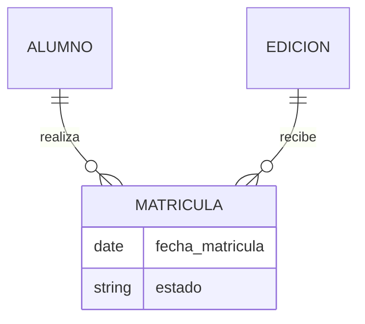
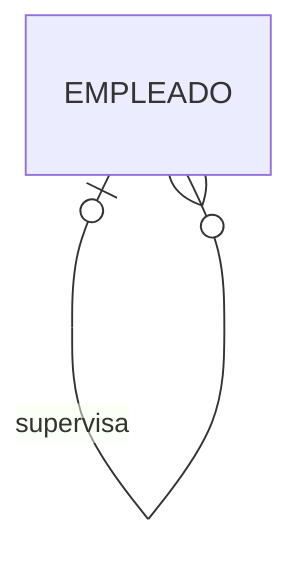
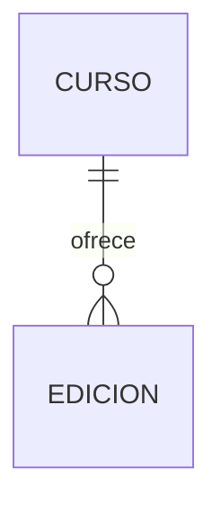
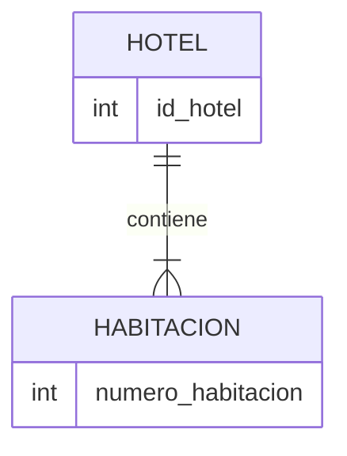
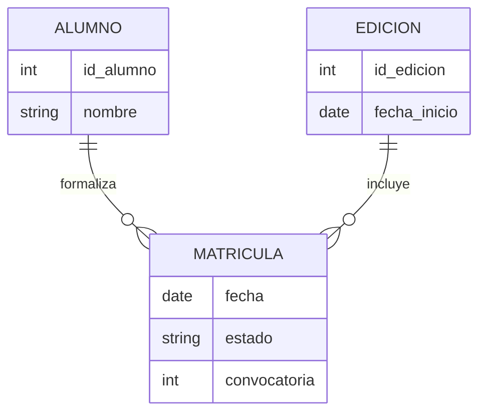
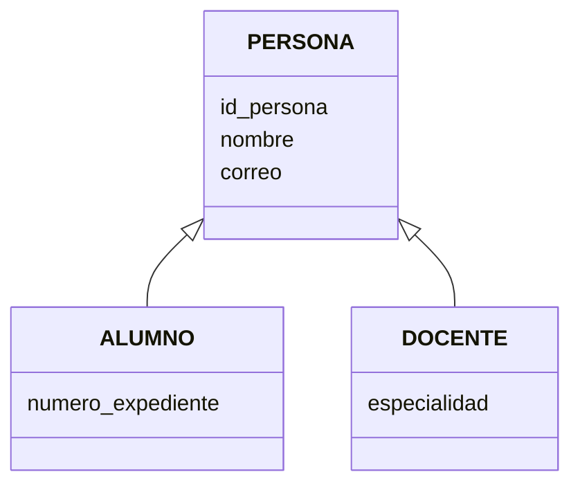
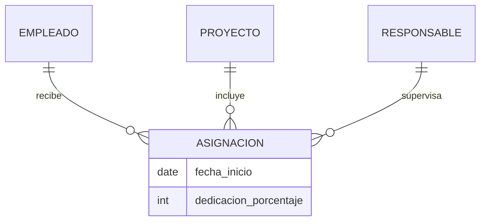
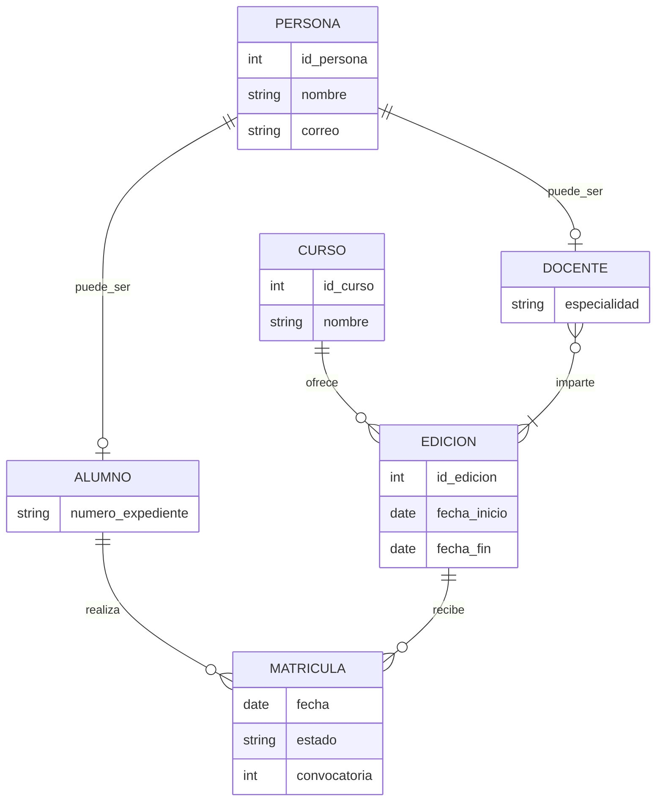

# Tema 2. Diseño conceptual: modelo entidad/relación

> **Módulo:** Bases de Datos · **Curso:** 1.º DAM  
> Del problema real a un modelo que podamos comprender, revisar y convertir posteriormente en una base de datos.

## Objetivos de aprendizaje

Al finalizar este tema serás capaz de:

- identificar entidades, atributos, relaciones y restricciones a partir de un enunciado;
- distinguir tipos de entidad y sus ocurrencias;
- seleccionar identificadores adecuados;
- representar atributos simples, compuestos, multivaluados y derivados;
- expresar cardinalidades mínimas y máximas;
- modelar relaciones binarias, recursivas y n-arias;
- reconocer dependencias de existencia e identificación;
- utilizar especialización, generalización y agregación cuando aporten claridad;
- detectar decisiones incorrectas o ambiguas en un diagrama;
- documentar reglas de negocio que el modelo gráfico no pueda representar.

---

## 1. Antes de dibujar: comprender el problema

Diseñar una base de datos no empieza creando tablas. Empieza comprendiendo una realidad concreta, denominada a veces **universo del discurso** o **minimundo**.

Supongamos que una academia nos dice:

> La academia ofrece cursos. Cada curso puede abrir varias ediciones a lo largo del año. El alumnado se matricula en una edición concreta. De cada matrícula se conserva la fecha y el estado.

Antes de elegir símbolos debemos resolver preguntas:

- ¿Curso y edición son el mismo concepto?
- ¿Puede existir un curso sin ediciones?
- ¿Puede abrirse una edición sin curso?
- ¿Puede una persona matricularse dos veces en la misma edición?
- ¿Qué estados puede tener una matrícula?

Un buen diagrama no elimina estas preguntas: nos obliga a descubrirlas y contestarlas.

> [!IMPORTANT]
> Un modelo es una representación simplificada de una realidad para un propósito. No intenta almacenar todo lo que sabemos, sino lo necesario para resolver el problema.

### 1.1. Fases del diseño

1. **Recogida y análisis de requisitos:** entender datos, operaciones y reglas.
2. **Diseño conceptual:** representar el dominio sin depender de un SGBD concreto.
3. **Diseño lógico:** transformar el modelo conceptual al modelo elegido, por ejemplo, el relacional.
4. **Diseño físico:** decidir estructuras de almacenamiento, índices, particiones y otros detalles del SGBD.

En este tema trabajaremos principalmente el **diseño conceptual**. La transformación a tablas y la normalización se estudiarán en el siguiente.

### 1.2. Modelo, esquema e instancia

- **Modelo de datos:** conjunto de conceptos y reglas que usamos para representar información.
- **Esquema:** descripción concreta de la estructura de un sistema, por ejemplo, el diagrama de una academia.
- **Instancia o estado:** datos existentes en un momento determinado.

El esquema indica que `ALUMNO` tiene `correo`; una instancia concreta indica que el correo de Ana es `ana@example.test`.

---

## 2. El modelo entidad/relación

El modelo entidad/relación, o **modelo E/R**, representa la estructura conceptual de un dominio mediante:

- **tipos de entidad**;
- **atributos**;
- **tipos de relación**;
- **restricciones**.

Fue propuesto por Peter P. Chen en 1976. Desde entonces han aparecido distintas notaciones. En estos apuntes utilizaremos principalmente los conceptos de la notación de Chen y expresaremos las cardinalidades con pares **(mínimo, máximo)**, porque hacen explícita tanto la obligatoriedad como el número máximo de participaciones.

> [!NOTE]
> Herramientas distintas pueden usar símbolos diferentes, como Chen, pata de cuervo o UML. La notación cambia; la regla de negocio representada debería ser la misma.

---

## 3. Entidades

Una **entidad** es algo del dominio con existencia propia sobre lo que necesitamos conservar información. Puede ser:

- físico: una persona, un vehículo o un ejemplar;
- conceptual: un curso, una cuenta o un departamento;
- un suceso relevante: una reserva, una matrícula o una inspección.

### 3.1. Tipo de entidad y ocurrencia

No debemos confundir:

- **tipo de entidad:** la definición general, como `ALUMNO`;
- **ocurrencia de entidad:** un alumno concreto;
- **conjunto de entidades:** todas las ocurrencias de un tipo existentes en un momento dado.

En el diagrama se representan **tipos**, no cada objeto individual.

### 3.2. Cómo nombrarlas

Usaremos nombres:

- en singular: `ALUMNO`, no `ALUMNOS`;
- mediante sustantivos claros;
- coherentes en todo el modelo;
- propios del dominio, evitando nombres vagos como `DATOS` o `COSAS`.

### 3.3. ¿Es realmente una entidad?

Un concepto suele merecer ser entidad cuando:

- posee varias ocurrencias distinguibles;
- tiene propiedades propias que necesitamos almacenar;
- participa en relaciones;
- tiene un ciclo de vida relevante para el sistema.

No todas las palabras importantes de un enunciado se convierten en entidades. Antes de decidir, pregunta:

1. ¿Necesitamos almacenar información propia sobre el concepto?
2. ¿Existen varias ocurrencias?
3. ¿Podemos distinguir unas de otras?
4. ¿Tiene sentido relacionarlo con otros conceptos?

Por ejemplo, `dirección` podría ser un atributo compuesto de `CLIENTE` o una entidad independiente si varias personas comparten direcciones, existen distintos tipos de dirección o necesitamos gestionarlas por separado.

---

## 4. Atributos

Un **atributo** describe una propiedad de una entidad o, en algunos casos, de una relación.

Ejemplos para `PERSONA`: identificador, nombre, fecha de nacimiento y correo electrónico.

### 4.1. Dominio de un atributo

El **dominio** es el conjunto de valores permitidos para un atributo. Incluye aspectos como:

- tipo de valor;
- formato;
- rango;
- unidades;
- valores válidos;
- posibilidad de ausencia.

Decir que `nota` es «un número» es poco preciso. Un dominio mejor sería: número decimal entre 0 y 10, con una cifra decimal.

### 4.2. Atributos simples y compuestos

- **Simple:** no interesa dividirlo en componentes, como `altura_cm`.
- **Compuesto:** contiene partes con significado propio, como `dirección`, formada por vía, número, código postal y localidad.

Que un valor pueda dividirse no obliga a modelarlo como compuesto. Lo hacemos cuando sus componentes son necesarios para consultas o reglas.

### 4.3. Atributos monovaluados y multivaluados

- **Monovaluado:** una ocurrencia tiene como máximo un valor, como la fecha de nacimiento.
- **Multivaluado:** una ocurrencia puede tener varios valores, como varios teléfonos de contacto.

Si necesitamos almacenar información adicional sobre cada valor —tipo de teléfono, prioridad o fecha de verificación— probablemente convenga convertirlo en una entidad relacionada.

### 4.4. Atributos almacenados y derivados

- **Almacenado:** su valor se conserva directamente.
- **Derivado:** se calcula a partir de otros datos.

La edad cambia con el tiempo; normalmente se almacena la fecha de nacimiento y se deriva la edad para una fecha concreta.

No todos los valores calculables deben derivarse siempre. A veces se almacena un resultado por razones legales, históricas o de rendimiento. La decisión debe documentarse.

### 4.5. Atributos opcionales

Un atributo puede no tener valor para determinadas ocurrencias. Hay que distinguir entre:

- valor desconocido;
- valor todavía no disponible;
- valor no aplicable;
- valor deliberadamente no registrado.

Todos podrían terminar representados como ausencia de valor, pero no significan lo mismo para el negocio.

### 4.6. Atributos de una relación

Un atributo pertenece a una relación cuando describe el hecho que vincula las entidades, no a una de ellas por separado.

En «un alumno se matricula en una edición», `fecha_matricula` y `estado` describen esa matrícula.

Este diagrama usa una entidad asociativa para poder mostrarlo con Mermaid. Conceptualmente, `fecha_matricula` y `estado` pertenecen a la asociación entre alumno y edición.

---

## 5. Identificadores y claves

Un **identificador** es un atributo o conjunto mínimo de atributos cuyos valores distinguen inequívocamente cada ocurrencia de un tipo de entidad.

### 5.1. Conceptos esenciales

- **Superclave:** conjunto de atributos que identifica de forma única, aunque pueda contener atributos innecesarios.
- **Clave candidata:** superclave mínima; si quitamos un atributo deja de identificar.
- **Clave primaria:** clave candidata elegida como identificador principal en el diseño lógico.
- **Clave alternativa:** clave candidata que no fue elegida como primaria.
- **Clave compuesta:** formada por más de un atributo.
- **Clave natural:** procede del dominio, como un código oficial estable.
- **Clave artificial o sustituta:** creada específicamente para identificar, como un número interno.

En diseño conceptual hablaremos preferentemente de **identificadores** o claves candidatas. Las claves foráneas pertenecen al modelo relacional y aparecerán al transformar relaciones en tablas.

> [!WARNING]
> Una clave foránea no es «la clave primaria de otra entidad» dentro del diagrama conceptual. Es un mecanismo del modelo relacional para representar referencias entre tablas.

### 5.2. Cómo elegir un buen identificador

Debe ser:

- único;
- obligatorio;
- mínimo;
- estable en el tiempo;
- conocido o generable cuando se crea la ocurrencia.

Un nombre no suele ser un buen identificador. Un documento oficial tampoco siempre es adecuado: puede no existir, cambiar, contener errores o estar sujeto a restricciones de privacidad.

---

## 6. Relaciones

Una **relación** representa una asociación relevante entre ocurrencias de uno o varios tipos de entidad.

Se suele nombrar con un verbo o expresión verbal:

- `ALUMNO se_matricula_en EDICION`;
- `DOCENTE imparte MODULO`;
- `PERSONA supervisa PERSONA`.

La relación debe poder leerse en ambos sentidos y producir frases coherentes.

### 6.1. Grado de una relación

El **grado** indica cuántos tipos de entidad participan:

- **unaria o recursiva:** participa un tipo de entidad;
- **binaria:** participan dos;
- **ternaria:** participan tres;
- **n-aria:** participan n tipos.

### 6.2. Relaciones recursivas y roles

En una relación recursiva, el mismo tipo de entidad participa con papeles distintos. Es obligatorio nombrar los **roles** para evitar ambigüedad.

Ejemplo: una persona empleada puede supervisar a otras personas empleadas.

Los roles serían `supervisor` y `supervisado`.

### 6.3. Relaciones ternarias

Una relación ternaria no debe sustituirse automáticamente por tres relaciones binarias: podrían expresar reglas diferentes.

Ejemplo: un proveedor suministra un producto para un proyecto. El precio acordado puede depender simultáneamente de los tres participantes.

Para comprobar si puede descomponerse, debemos analizar si las relaciones binarias conservan todas las asociaciones permitidas y restricciones del enunciado.

---

## 7. Cardinalidad y participación

La cardinalidad indica cuántas ocurrencias de una entidad pueden o deben relacionarse con una ocurrencia concreta de otra entidad.

Usaremos la notación **(mínimo, máximo)**:

- `(0,1)`: participación opcional y como máximo una;
- `(1,1)`: exactamente una;
- `(0,N)`: ninguna, una o muchas;
- `(1,N)`: al menos una y posiblemente muchas.

### 7.1. Cardinalidad máxima

La cardinalidad máxima origina las clasificaciones habituales:

- uno a uno (`1:1`);
- uno a muchos (`1:N`);
- muchos a muchos (`N:M`).

Pero `1:N` no informa de si la participación es obligatoria. Por eso necesitamos también el mínimo.

### 7.2. Participación mínima

- **Parcial u opcional:** mínimo `0`.
- **Total u obligatoria:** mínimo `1`.

Ejemplo:

> Cada edición pertenece exactamente a un curso. Un curso puede no tener todavía ediciones o tener muchas.

- Para una `EDICION`, el número de cursos relacionados es `(1,1)`.
- Para un `CURSO`, el número de ediciones relacionadas es `(0,N)`.

### 7.3. Método para calcular cardinalidades

No adivines mirando el dibujo. Formula dos preguntas:

1. Para **una** ocurrencia de A, ¿con cuántas ocurrencias de B puede relacionarse como mínimo y como máximo?
2. Para **una** ocurrencia de B, ¿con cuántas ocurrencias de A puede relacionarse como mínimo y como máximo?

Después busca contraejemplos y casos límite.

> [!TIP]
> Palabras como «cada», «puede», «debe», «solo», «al menos» y «varios» suelen esconder restricciones de cardinalidad.

---

## 8. Entidades fuertes y débiles

Una entidad es **fuerte** cuando dispone de un identificador propio independiente.

Una entidad es **débil por identificación** cuando no puede identificarse únicamente mediante sus atributos y necesita:

- su **identificador parcial**;
- el identificador de una entidad propietaria;
- una **relación identificadora** con dicha entidad.

Ejemplo: el número de habitación puede ser único dentro de un hotel, pero no entre todos los hoteles. Una habitación podría identificarse mediante `(hotel, numero_habitacion)`.

`numero_habitacion` actúa como identificador parcial. La existencia de una habitación concreta depende del hotel al que pertenece.

### 8.1. Dependencia de existencia y de identificación

No son exactamente lo mismo:

- **Dependencia de existencia:** una ocurrencia no puede existir sin otra.
- **Dependencia de identificación:** necesita el identificador de otra para ser identificada.

Un pedido puede depender de la existencia de un cliente según las reglas del sistema y, aun así, tener un identificador propio. Por tanto, no sería necesariamente una entidad débil por identificación.

---

## 9. Entidades asociativas

Una relación `N:M` con atributos propios o con necesidad de participar en otras relaciones suele tratarse como una **entidad asociativa**.

Ejemplo: `MATRICULA` conecta `ALUMNO` y `EDICION`, y posee fecha, estado y convocatoria.

La entidad asociativa no se crea «porque toda relación N:M deba ser una entidad» en el nivel conceptual. Se usa cuando el vínculo tiene identidad o comportamiento relevante, atributos propios o debe relacionarse con otros conceptos.

---

## 10. Modelo E/R extendido

El modelo E/R extendido incorpora mecanismos para representar reglas más complejas.

### 10.1. Superclase y subclase

- **Superclase:** tipo de entidad general que contiene atributos y relaciones comunes.
- **Subclase:** subconjunto de ocurrencias de la superclase con propiedades o relaciones específicas.

Toda ocurrencia de una subclase es también una ocurrencia de la superclase. Las subclases **heredan** sus atributos, identificador y relaciones.

Ejemplo: `PERSONA` puede especializarse en `ALUMNO` y `DOCENTE`.

No conviene crear subclases si solo deseamos etiquetar categorías sin atributos, relaciones ni comportamientos específicos. Un atributo `tipo` podría ser suficiente.

### 10.2. Especialización y generalización

- **Especialización:** partimos de una superclase y definimos subclases por sus diferencias.
- **Generalización:** partimos de varios tipos semejantes y extraemos sus características comunes en una superclase.

El resultado puede ser parecido, pero el proceso de razonamiento va en direcciones opuestas.

### 10.3. Restricción de completitud

- **Total:** toda ocurrencia de la superclase debe pertenecer al menos a una subclase.
- **Parcial:** pueden existir ocurrencias que no pertenezcan a ninguna subclase.

Pregunta: ¿toda persona del sistema tiene que ser alumno o docente, o puede existir una persona registrada con otro papel?

### 10.4. Restricción de solapamiento

- **Disjunta:** una ocurrencia puede pertenecer como máximo a una subclase.
- **Solapada:** puede pertenecer a varias subclases simultáneamente.

Una persona podría ser alumno y docente a la vez; en ese caso la especialización es solapada.

Las restricciones de completitud y solapamiento son independientes. Una especialización puede ser total y solapada, total y disjunta, parcial y solapada, o parcial y disjunta.

### 10.5. Discriminador

Un **discriminador** es un atributo o condición que determina la pertenencia a una subclase. Algunas pertenencias se solapan o se determinan mediante reglas complejas y no pueden expresarse con un único atributo.

### 10.6. Jerarquías y retículas

Una subclase puede especializarse de nuevo. Si una subclase tiene varias superclases hablamos de una **retícula** y de herencia múltiple conceptual. Debe usarse con cuidado porque complica tanto la interpretación como la transformación posterior.

---

## 11. Agregación

La **agregación** permite tratar una relación, junto con sus participantes, como una unidad conceptual que puede relacionarse con otra entidad.

Ejemplo:

- un `EMPLEADO` trabaja en un `PROYECTO`;
- un `RESPONSABLE` supervisa esa asignación concreta, no al empleado o al proyecto de forma aislada.

Podemos conceptualizar la asignación como un objeto de nivel superior:

Mermaid representa aquí la agregación mediante una entidad asociativa. En notación E/R extendida puede dibujarse un contorno alrededor de la relación y sus entidades participantes.

Antes de utilizar una agregación, comprueba si una entidad asociativa explica el dominio con mayor claridad. El objetivo no es usar el símbolo más avanzado, sino comunicar correctamente la regla.

---

## 12. Restricciones semánticas

Las cardinalidades no expresan todas las reglas posibles. Ejemplos:

- un docente no puede supervisarse a sí mismo;
- la fecha de fin debe ser posterior a la fecha de inicio;
- una persona menor de edad necesita representante;
- la suma de porcentajes de dedicación no puede superar el 100 %;
- un aula no puede albergar dos sesiones simultáneas;
- un módulo debe ser impartido por personal con una determinada acreditación.

Estas reglas deben documentarse aunque el diagrama no pueda representarlas completamente.

Una tabla de restricciones ayuda a hacerlas verificables:

| Código | Regla | Elementos afectados | Momento de validación |
|---|---|---|---|
| RN-01 | Una edición termina después de comenzar | EDICION | Alta y modificación |
| RN-02 | Una persona no se matricula dos veces en la misma edición | MATRICULA | Alta |
| RN-03 | Una persona no puede supervisarse a sí misma | EMPLEADO | Alta y modificación |

> [!IMPORTANT]
> Si una regla no aparece en el diagrama, en el glosario o en el catálogo de restricciones, probablemente se perderá durante la implementación.

---

## 13. Método de trabajo

### Paso 1. Leer y delimitar

- identifica el objetivo del sistema;
- marca sustantivos, verbos, cantidades y condiciones;
- distingue requisitos de ejemplos accidentales;
- anota dudas y contradicciones.

### Paso 2. Crear un glosario

Define cada término antes de modelarlo:

| Término | Definición | Ejemplo | Dudas |
|---|---|---|---|
| Curso | Oferta formativa estable | Bases de datos | ¿Puede retirarse? |
| Edición | Realización de un curso en unas fechas | BD, octubre 2026 | ¿Tiene un único docente? |

### Paso 3. Proponer entidades

Busca conceptos con identidad y ciclo de vida. Elimina duplicados y sinónimos.

### Paso 4. Añadir relaciones

Convierte los verbos relevantes en asociaciones. Nómbralas para que puedan leerse como frases.

### Paso 5. Determinar cardinalidades

Formula las dos preguntas de mínimo y máximo para cada extremo. Registra las suposiciones.

### Paso 6. Incorporar atributos e identificadores

Asigna cada atributo al concepto que realmente describe. Revisa dominios, opcionalidad y estabilidad de los identificadores.

### Paso 7. Evaluar construcciones avanzadas

Comprueba si hay:

- entidades débiles;
- relaciones recursivas o n-arias;
- entidades asociativas;
- especializaciones;
- agregaciones.

### Paso 8. Documentar reglas no representables

Usa un catálogo de restricciones y no confíes en que «se entiende».

### Paso 9. Validar con datos de ejemplo

Construye pequeñas instancias y prueba:

- un caso habitual;
- los mínimos;
- los máximos;
- excepciones;
- datos que deberían rechazarse.

### Paso 10. Revisar con las partes interesadas

Lee el diagrama como frases. Una persona conocedora del dominio debería poder confirmar o corregir las reglas sin comprender detalles del futuro SGBD.

---

## 14. Errores frecuentes

### Convertir todos los sustantivos en entidades

Los sustantivos solo ofrecen candidatos. «Nombre» suele ser atributo; «matrícula» puede ser identificador, atributo o entidad según el contexto.

### Confundir una entidad con una tabla

El modelo conceptual no es todavía el esquema relacional. Una relación podrá transformarse en una tabla y una jerarquía podrá implementarse de varias maneras.

### Introducir claves foráneas en el modelo conceptual

Las relaciones se representan mediante relaciones, no copiando identificadores entre entidades.

### Indicar solamente `1:N`

Falta especificar si cada participación es opcional u obligatoria.

### Colocar un atributo donde resulta más cómodo

Pregunta de qué hecho depende el valor. La fecha de matrícula depende del vínculo entre alumno y edición.

### Usar una entidad débil solo porque depende de otra

La debilidad por identificación exige que la entidad no disponga de identificador completo propio.

### Descomponer siempre una relación ternaria

Tres relaciones binarias pueden permitir combinaciones que la relación ternaria original no permitía.

### Crear subclases innecesarias

Si no hay propiedades ni relaciones específicas, quizá baste con un atributo clasificador.

### Modelar una solución técnica en vez del dominio

`TABLA_USUARIOS`, `ID_FK` o `ARRAY_DATOS` describen una implementación. El modelo conceptual debería hablar el lenguaje del problema.

---

## 15. Ejemplo integrado: academia

### 15.1. Reglas

1. La academia ofrece cursos.
2. Un curso puede abrir cero o muchas ediciones.
3. Cada edición corresponde exactamente a un curso.
4. El alumnado se matricula en ediciones.
5. Una matrícula conserva fecha, estado y convocatoria.
6. Una persona no puede matricularse dos veces en la misma edición y convocatoria.
7. Una edición es impartida por uno o varios docentes.
8. Un docente puede no impartir ninguna edición temporalmente.
9. Alumnos y docentes son tipos de persona y una persona puede asumir ambos papeles.

### 15.2. Diagrama simplificado

### 15.3. Lo que el diagrama no cuenta por sí solo

- La especialización de `PERSONA` es parcial y solapada.
- `fecha_fin` debe ser posterior a `fecha_inicio`.
- La combinación alumno, edición y convocatoria debe ser única.
- El correo debe cumplir las reglas acordadas y su unicidad debe decidirse.
- Debemos aclarar qué ocurre con las matrículas si se cancela una edición.

El diagrama es una parte de la documentación, no toda la documentación.

---

## 16. Lista de comprobación

### Comprensión

- [ ] El objetivo y los límites del sistema están claros.
- [ ] Existe un glosario sin sinónimos ambiguos.
- [ ] Las dudas y suposiciones están documentadas.

### Entidades y atributos

- [ ] Cada entidad posee significado, ocurrencias e identidad.
- [ ] Los nombres son claros, singulares y coherentes.
- [ ] Cada atributo pertenece al elemento que describe.
- [ ] Los dominios y la opcionalidad están definidos.
- [ ] Los valores multivaluados y derivados están justificados.
- [ ] Los identificadores son únicos, mínimos y estables.

### Relaciones

- [ ] Cada relación expresa una regla necesaria.
- [ ] Puede leerse correctamente en ambos sentidos.
- [ ] Los roles están indicados cuando hay ambigüedad.
- [ ] Se han estudiado mínimos y máximos en todos los extremos.
- [ ] Las relaciones ternarias no se han descompuesto sin análisis.

### Modelo extendido

- [ ] Las entidades débiles cumplen dependencia de identificación.
- [ ] Las especializaciones indican completitud y solapamiento.
- [ ] Las subclases aportan atributos o relaciones específicas.
- [ ] Las agregaciones o entidades asociativas están justificadas.

### Validación

- [ ] El modelo admite casos válidos y rechaza casos inválidos.
- [ ] Las restricciones no representables están documentadas.
- [ ] El diagrama es legible y no depende de conocer el enunciado de memoria.

---

## 17. Actividades de autoevaluación

1. Explica la diferencia entre modelo, esquema e instancia.
2. Decide si `dirección` debe ser atributo compuesto o entidad en dos contextos diferentes.
3. Propón dos claves candidatas para una entidad y analiza su estabilidad.
4. Escribe las cuatro combinaciones posibles de participación mínima y máxima.
5. Modela una relación recursiva entre empleados indicando sus roles.
6. Construye un ejemplo donde una relación ternaria no pueda sustituirse por tres binarias.
7. Explica por qué dependencia de existencia y entidad débil no son sinónimos.
8. Convierte una relación `N:M` con atributos en una entidad asociativa.
9. Diseña una especialización total y disjunta y otra parcial y solapada.
10. Escribe tres reglas de negocio que un diagrama E/R no pueda expresar completamente.
11. Localiza cinco decisiones que falten en el ejemplo de la academia.
12. Revisa un diagrama propio con la lista de comprobación y documenta los cambios.

---

## 18. Glosario

| Término | Definición breve |
|---|---|
| Agregación | Abstracción que permite tratar una relación y sus participantes como una unidad. |
| Atributo | Propiedad que describe una entidad o relación. |
| Cardinalidad | Número mínimo y máximo de participaciones permitidas. |
| Clave candidata | Conjunto mínimo de atributos que identifica unívocamente. |
| Dominio | Conjunto de valores admitidos para un atributo. |
| Entidad asociativa | Concepto que representa una asociación con propiedades o participación propia. |
| Entidad débil | Entidad que necesita el identificador de otra para ser identificada. |
| Especialización | Proceso de definir subclases a partir de una superclase. |
| Generalización | Proceso de extraer una superclase común a varios tipos. |
| Identificador parcial | Atributo que distingue ocurrencias débiles dentro de una misma entidad propietaria. |
| Instancia | Estado concreto de los datos en un momento. |
| Modelo conceptual | Representación del dominio independiente de la implementación. |
| Participación | Obligatoriedad u opcionalidad de una entidad en una relación. |
| Relación | Asociación relevante entre ocurrencias de entidades. |
| Restricción semántica | Regla del dominio que limita los estados válidos. |
| Rol | Función de una entidad dentro de una relación. |
| Subclase | Subconjunto especializado de una superclase. |
| Tipo de entidad | Definición de una clase de objetos del dominio. |

