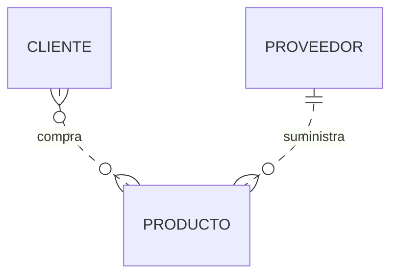
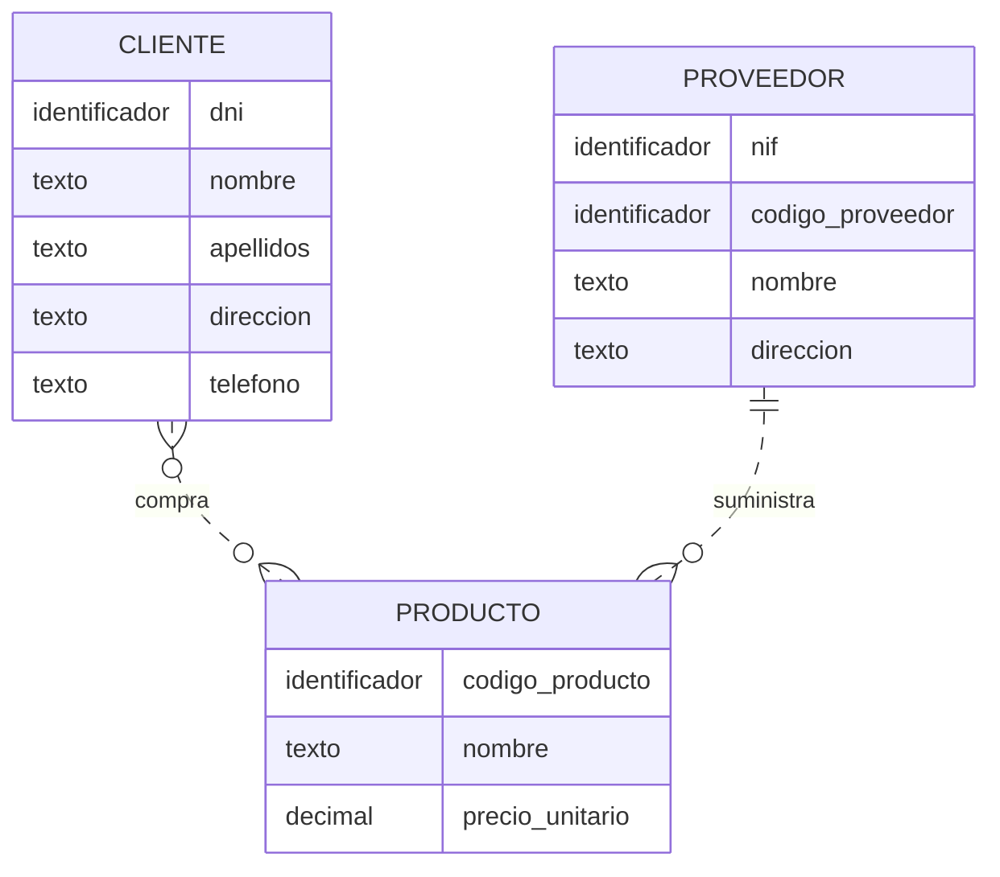
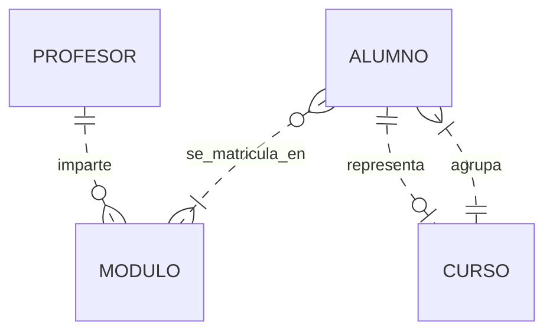
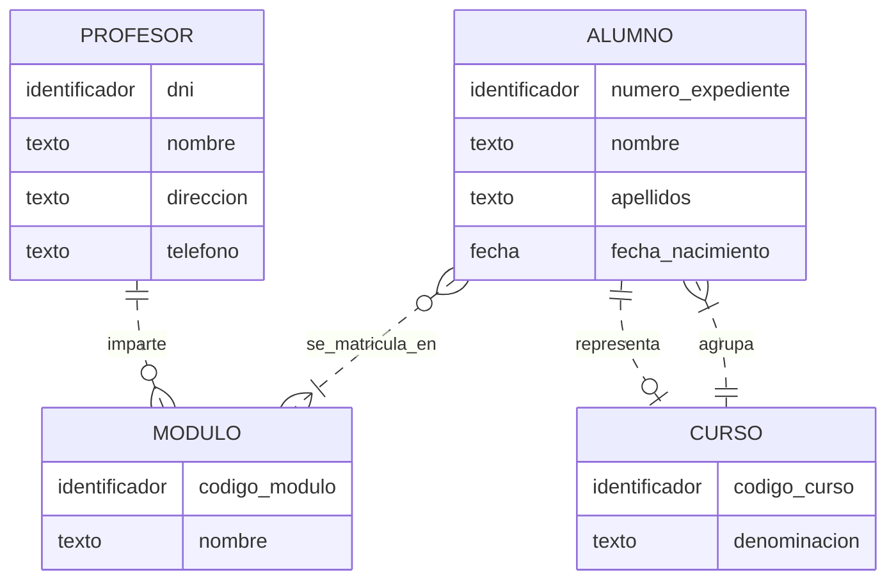

# Guía resuelta. Cómo construir un modelo entidad/relación

Esta guía desarrolla dos ejemplos paso a paso. El objetivo es comprender cómo se pasa de un enunciado a un modelo conceptual y por qué se toma cada decisión.

El resultado será un conjunto de entidades, atributos, identificadores, relaciones y reglas. Todavía no vamos a crear tablas mediante SQL ni a introducir claves foráneas.

## Índice

- [1. Método de resolución](#metodo)
- [2. Ejemplo resuelto: una tienda](#tienda)
- [3. Ejemplo resuelto: un instituto](#instituto)
- [4. Cómo dibujarlo con la notación de Chen](#chen)
- [5. Qué debemos recordar](#resumen)

## 1. Método de resolución

En los dos ejemplos seguiremos estos pasos:

1. **Marcar en el enunciado las posibles entidades y las relaciones.**
2. **Proponer las frases que describan el problema.**
3. **Generar los modelos de cada frase.**
4. **Realizar un estudio de cardinalidad.**
5. **Generar el modelo completo E/R.**
6. **Colocar los atributos a cada entidad e interrelación y señalar los identificadores.**
7. **Revisar el modelo y documentar las restricciones adicionales.**

Primero construiremos la estructura de entidades y relaciones. En el paso 3 cada frase se representa mediante un esquema parcial, todavía sin cardinalidades. En el paso 4 se deducen sus mínimos y máximos; en el paso 5 se reúnen las partes. Los atributos se incorporan en el paso 6.

El último paso sirve para comprobar que el resultado expresa las reglas del enunciado. Si detectamos un problema, podemos volver a los pasos anteriores.

### Lo que dice el enunciado y lo que debemos suponer

A veces el texto permite deducir un máximo, pero no un mínimo. «Puede comprar varios productos» no aclara si se registra un cliente antes de su primera compra.

En esos casos, anotaremos una **suposición**. No es una regla que debamos inventar en silencio: en un proyecto real se confirmaría con la persona responsable.

Usaremos estas parejas:

| Pareja | Significado |
|---|---|
| `(0,1)` | Ninguna o una |
| `(1,1)` | Exactamente una |
| `(0,N)` | Ninguna, una o muchas |
| `(1,N)` | Una o muchas |

Los diagramas finales utilizan **pata de cuervo**, como los ejemplos de los apuntes. Las tablas explican siempre la lectura en ambos sentidos. Al final también se indica cómo trasladarlos a un dibujo de Chen.

## 2. Ejemplo resuelto: una tienda

### Enunciado

> Una tienda vende productos a varios clientes. Después de hablar con los responsables de la tienda, se necesita conocer los datos personales de los clientes: nombre, apellidos, DNI, dirección y teléfono.
>
> Cada producto tiene un nombre, un código, un precio unitario y el código del proveedor que nos suministra ese producto. Un cliente puede comprar varios productos a la empresa, y un mismo producto puede ser comprado por varios clientes.
>
> Los productos son suministrados por diferentes proveedores. Un producto solo puede ser suministrado por un proveedor, y un proveedor puede suministrar diferentes productos. De cada proveedor se desea conocer el NIF, nombre y dirección.

### Paso 1. Marcar las posibles entidades y relaciones

Señalamos los conceptos candidatos en **negrita** y las asociaciones en *cursiva*:

> Un **cliente** puede *comprar* varios **productos**, y un mismo **producto** puede *ser comprado* por varios **clientes**. Los **productos** *son suministrados* por **proveedores**. Un **proveedor** puede *suministrar* diferentes **productos**.

Primero distinguimos datos y asociaciones:

| Fragmento | Qué nos indica |
|---|---|
| Datos personales de los clientes | Necesitamos representar clientes y sus características |
| Nombre, código y precio de cada producto | Necesitamos representar productos |
| NIF, nombre y dirección del proveedor | Necesitamos representar proveedores |
| Un cliente puede comprar varios productos | Existe una relación de compra |
| Un producto puede ser comprado por varios clientes | La compra admite varios clientes por producto |
| Cada producto tiene un proveedor | Existe una relación de suministro |

La tienda es el contexto del sistema. No necesitamos una entidad `TIENDA` porque el enunciado habla de una única tienda y no pide guardar sus datos ni distinguir varias sedes.

Tenemos tres entidades:

| Entidad | Qué representa | Una ocurrencia de ejemplo |
|---|---|---|
| CLIENTE | Persona que compra o puede comprar en la tienda | Un cliente concreto |
| PRODUCTO | Artículo del catálogo | Un teclado con código P01 |
| PROVEEDOR | Organización o persona que suministra artículos | Un proveedor concreto |

¿Por qué `nombre` no es una entidad? Porque aquí solo describe a un cliente, producto o proveedor. No necesitamos gestionar nombres de forma independiente.

Las relaciones candidatas son **COMPRA** y **SUMINISTRA**. Guardamos la lista de datos personales y características para incorporarlos como atributos en el paso 6.

### Paso 2. Proponer las frases que describen el problema

Buscamos los verbos que conectan las entidades:

| Relación | Lectura directa | Lectura inversa |
|---|---|---|
| COMPRA | Un cliente compra productos | Un producto es comprado por clientes |
| SUMINISTRA | Un proveedor suministra productos | Un producto es suministrado por un proveedor |

No añadimos una relación directa entre CLIENTE y PROVEEDOR: el enunciado no afirma que los clientes compren directamente a los proveedores.

Trabajaremos con estas dos frases principales:

1. **Un cliente compra productos.**
2. **Un proveedor suministra productos.**

Sus lecturas inversas nos ayudarán después a estudiar las cardinalidades.

### Paso 3. Generar los modelos de cada frase

Representamos cada frase por separado. Si lo dibujamos con Chen, las entidades son rectángulos y la relación es un rombo.

| Modelo parcial | Primera entidad | Relación | Segunda entidad |
|---|---|---|---|
| Frase 1 | CLIENTE | COMPRA | PRODUCTO |
| Frase 2 | PROVEEDOR | SUMINISTRA | PRODUCTO |

Por ahora estos modelos solo indican **qué conceptos se conectan**. No hemos establecido cuántas ocurrencias participan ni hemos añadido atributos.

PRODUCTO aparece en los dos modelos parciales porque participa en dos relaciones; al unirlos será una única entidad.

### Paso 4. Realizar el estudio de cardinalidad

#### 4.1. Relación COMPRA

**Primera pregunta: para un cliente, ¿cuántos productos puede haber?**

El enunciado indica que puede comprar varios. El máximo es `N`. No exige que haya comprado ya para poder registrarlo.

**Suposición:** permitimos registrar clientes antes de su primera compra. El mínimo será `0`.

**Segunda pregunta: para un producto, ¿cuántos clientes puede haber?**

El texto indica que puede ser comprado por varios clientes. El máximo es `N`.

**Suposición:** permitimos productos del catálogo que todavía no se hayan vendido. El mínimo será `0`.

| Partimos de… | Contamos… | Mínimo y máximo |
|---|---|---|
| Un CLIENTE | Los PRODUCTOS que compra | `(0,N)` |
| Un PRODUCTO | Los CLIENTES que lo compran | `(0,N)` |

**Conclusión:** COMPRA es una relación **muchos a muchos (`N:M`)**, opcional en ambos extremos según nuestras suposiciones.

##### ¿Tenemos que crear una entidad COMPRA?

Para este enunciado basta con una relación `N:M`: interesa saber qué clientes compran qué productos.

Esta relación básica no distingue dos compras del mismo cliente y producto en fechas diferentes. Si se necesitara guardar un historial de operaciones, cantidades o precios aplicados en cada venta, habría que ampliar el modelo con ventas y sus detalles, u otra solución acorde con los requisitos.

No añadimos esa ampliación porque no se pide. Tampoco eliminamos una relación `N:M` solo porque más adelante pueda requerir una tabla intermedia: seguimos en el nivel conceptual.

#### 4.2. Relación SUMINISTRA

**Para un producto, ¿cuántos proveedores puede haber?**

El máximo es uno. Interpretamos «el proveedor que nos suministra ese producto» como que todo producto registrado tiene proveedor asignado. Por tanto, usamos `(1,1)`.

La expresión «solo puede ser suministrado por uno» fija por sí sola el máximo; si se permitieran productos pendientes de asignación, el mínimo cambiaría a cero.

**Para un proveedor, ¿cuántos productos puede haber?**

Puede suministrar varios: máximo `N`. Como no se establece el mínimo, permitimos registrar proveedores antes de asociarles productos.

| Partimos de… | Contamos… | Mínimo y máximo |
|---|---|---|
| Un PROVEEDOR | Los PRODUCTOS que suministra | `(0,N)` |
| Un PRODUCTO | Sus PROVEEDORES | `(1,1)` |

**Conclusión:** SUMINISTRA es **uno a muchos (`1:N`)** desde PROVEEDOR hacia PRODUCTO.

### Paso 5. Generar el modelo completo E/R

Unimos los dos modelos parciales usando un único rectángulo para PRODUCTO y conservando ambas relaciones. Añadimos las cardinalidades obtenidas:

El modelo reúne **CLIENTE, PRODUCTO y PROVEEDOR**, conectados por **COMPRA** y **SUMINISTRA**. Todavía no aparecen los atributos.

### Paso 6. Colocar los atributos y señalar los identificadores

#### 6.1. Atributos de las entidades

| Entidad | Atributos |
|---|---|
| CLIENTE | DNI, nombre, apellidos, dirección, teléfono |
| PRODUCTO | Código de producto, nombre, precio unitario |
| PROVEEDOR | NIF, código de proveedor, nombre, dirección |

Para esta solución conservamos dirección como un atributo simple. Podríamos descomponerlo en calle, número, código postal y localidad si necesitáramos trabajar con esas partes por separado. Consideramos un teléfono por cliente, tal como aparece en el texto.

##### ¿Qué hacemos con el código del proveedor mencionado en PRODUCTO?

Ese dato expresa **qué proveedor suministra el producto**. En el modelo conceptual lo representamos mediante la relación `SUMINISTRA`.

El enunciado menciona un código de proveedor, aunque después solo enumera NIF, nombre y dirección. Para conservar toda la información, adoptamos esta interpretación:

- El proveedor tiene un código interno, único y obligatorio.
- También se almacena su NIF.
- El producto se asocia a ese proveedor mediante `SUMINISTRA`.

Por tanto, en el diagrama conceptual no copiamos `codigo_proveedor` dentro de PRODUCTO. La referencia se representa mediante la relación. Cuando se transforme el modelo en tablas se decidirá cómo implementarla.

> **Alternativa válida:** si los responsables aclaran que «código del proveedor» se refiere al propio NIF, no hace falta añadir un código interno. Lo importante es aclarar la interpretación y evitar dos atributos que representen exactamente lo mismo.

#### 6.2. Identificadores

| Entidad | Identificador elegido | Justificación |
|---|---|---|
| CLIENTE | DNI | En este ejercicio suponemos que es obligatorio y único para cada cliente |
| PRODUCTO | Código de producto | Distingue cada artículo del catálogo |
| PROVEEDOR | NIF | Suponemos que identifica de forma única a cada proveedor |

El código interno del proveedor sería otro identificador candidato bajo la interpretación anterior.

Un nombre no sirve como identificador: dos personas o dos productos pueden tener el mismo nombre. En un sistema real podría utilizarse un identificador interno para clientes; aquí empleamos el DNI solicitado, con la suposición indicada.

#### 6.3. Atributos de las relaciones

El enunciado no solicita atributos propios de COMPRA ni de SUMINISTRA. El precio unitario indicado describe al producto; no se pide conservar un precio histórico diferente para cada operación.

No añadimos fecha ni cantidad a COMPRA por iniciativa propia. Si se pidiera registrar ventas repetidas, habría que revisar el alcance y ampliar el modelo.

#### 6.4. Modelo con los atributos incorporados

Las etiquetas `texto`, `decimal` e `identificador` describen los atributos de manera orientativa. No son instrucciones SQL. En PROVEEDOR se muestran los dos identificadores candidatos; hemos elegido el NIF como principal para explicar el ejercicio.

Las líneas discontinuas representan relaciones no identificadoras: cada entidad dispone de identificador propio. No significan que toda participación sea opcional; eso lo indican las marcas de los extremos.

### Paso 7. Revisar el modelo y documentar las restricciones

| Situación | ¿Se admite? | Motivo |
|---|---|---|
| Un cliente compra un teclado y un ratón | Sí | Puede relacionarse con varios productos |
| Dos clientes compran el mismo modelo de teclado | Sí | Un producto puede relacionarse con varios clientes |
| Un cliente todavía no ha comprado | Sí, según la suposición adoptada | Su mínimo es cero |
| Un proveedor suministra tres productos | Sí | Su máximo es N |
| Un producto tiene dos proveedores | No | Su máximo de proveedores es uno |
| Un producto no tiene proveedor asignado | No, en esta solución | Hemos establecido participación obligatoria |

**Resultado:** tres entidades, dos relaciones y las suposiciones de participación documentadas.

Conservamos junto al dibujo las decisiones adoptadas: clientes y proveedores pueden registrarse antes de tener compras o productos asociados; los productos pueden no haberse vendido, pero tienen exactamente un proveedor. El código interno del proveedor se mantiene como identificador candidato distinto del NIF, salvo aclaración contraria.

## 3. Ejemplo resuelto: un instituto

### Enunciado

> Se desea guardar los datos de los profesores de un instituto: DNI, nombre, dirección y teléfono. Los profesores imparten módulos, y cada módulo tiene un código y un nombre.
>
> Cada alumno está matriculado en uno o varios módulos. De cada alumno se desea guardar el número de expediente, nombre, apellidos y fecha de nacimiento.
>
> Los profesores pueden impartir varios módulos, pero un módulo solo puede ser impartido por un profesor. Cada curso tiene un grupo de alumnos, uno de los cuales es el delegado del grupo.

### Paso 1. Marcar las posibles entidades y relaciones

Señalamos los candidatos en el enunciado:

> Los **profesores** *imparten* **módulos**. Cada **alumno** *está matriculado* en uno o varios **módulos**. Cada **curso** *tiene un grupo de* **alumnos**, uno de los cuales *es el delegado* del grupo.

Las asociaciones candidatas son **IMPARTE**, **SE_MATRICULA_EN**, **AGRUPA** y **REPRESENTA**. Antes de dibujarlas, aclaramos los conceptos.

#### ¿Qué significa «curso» en este ejercicio?

El enunciado utiliza «curso» y «grupo», pero no explica si un curso puede tener varios grupos.

Para resolverlo adoptaremos una interpretación sencilla: **CURSO representa un grupo concreto de alumnado**, por ejemplo, «1.º DAM A», en el ámbito temporal de este ejercicio. Cada alumno pertenece a uno de esos grupos.

No se trata de la distinción entre curso y edición del ejemplo de la academia. Aquí no necesitamos introducir EDICION.

> Si se quisiera distinguir el nivel «1.º DAM» de los grupos A y B, habría que separar CURSO y GRUPO. Si se quisiera conservar el historial de varios años, también habría que incorporar esa dimensión. Nada de eso está definido en este enunciado.

Trabajaremos además con estas decisiones explícitas:

| Decisión | Interpretación adoptada |
|---|---|
| Asignación de profesorado | Cada módulo tiene exactamente un profesor; un profesor puede estar pendiente de asignación |
| Matrícula del alumnado | Todo alumno está matriculado en al menos un módulo, como exige el texto |
| Módulos sin alumnado | Se permite registrar un módulo antes de tener estudiantes |
| Pertenencia al grupo | Cada alumno pertenece exactamente a un CURSO; cada CURSO tiene al menos un alumno |
| Delegación | Cada CURSO tiene exactamente un delegado, que pertenece a ese mismo CURSO |

Los máximos y algunas obligaciones proceden del texto; las demás decisiones completan aspectos que habría que confirmar con el instituto.

| Entidad | Por qué aparece |
|---|---|
| PROFESOR | Tiene datos propios e imparte módulos |
| MODULO | Tiene código y nombre; se relaciona con profesores y alumnos |
| ALUMNO | Tiene expediente y datos personales; se matricula en módulos |
| CURSO | Agrupa alumnos y tiene un delegado |

#### ¿DELEGADO es otra entidad?

No necesitamos una entidad independiente: **el delegado es un alumno que desempeña un papel respecto a un curso**. Sus datos personales ya están en ALUMNO.

Ese papel se representa mediante una relación. Crear otra entidad con nombre, apellidos y expediente duplicaría datos sin que el enunciado lo requiera.

### Paso 2. Proponer las frases que describen el problema

| Relación | Entidades que conecta | Qué representa |
|---|---|---|
| IMPARTE | PROFESOR y MODULO | Asignación de docencia |
| SE_MATRICULA_EN | ALUMNO y MODULO | Módulos que cursa cada alumno |
| AGRUPA | CURSO y ALUMNO | Pertenencia al grupo |
| REPRESENTA | ALUMNO y CURSO | Papel de delegado |

Entre ALUMNO y CURSO hay **dos relaciones distintas**. Pertenecer a un grupo no es lo mismo que ser su delegado.

No añadimos una relación CURSO–MODULO porque el texto no explica qué módulos corresponden a cada curso. Si se necesitara esa información, habría que preguntar y ampliar el modelo.

Las frases principales y sus lecturas inversas son:

| Frase | Lectura inversa |
|---|---|
| Un profesor imparte módulos | Un módulo es impartido por un profesor |
| Un alumno se matricula en módulos | Un módulo tiene alumnos matriculados |
| Un curso agrupa alumnos | Un alumno pertenece a un curso |
| Un alumno representa a un curso como delegado | Un curso tiene un alumno delegado |

Separar las dos últimas frases evita confundir pertenencia al grupo con delegación.

### Paso 3. Generar los modelos de cada frase

Dibujamos cuatro modelos parciales, cada uno con dos entidades y una relación:

| Modelo parcial | Primera entidad | Relación | Segunda entidad |
|---|---|---|---|
| Frase 1 | PROFESOR | IMPARTE | MODULO |
| Frase 2 | ALUMNO | SE_MATRICULA_EN | MODULO |
| Frase 3 | CURSO | AGRUPA | ALUMNO |
| Frase 4 | ALUMNO | REPRESENTA | CURSO |

Los modelos 3 y 4 conectan las mismas entidades, pero **expresan hechos diferentes**. Se necesitan ambas relaciones.

En este paso todavía no colocamos atributos ni decidimos las cardinalidades del dibujo.

### Paso 4. Realizar el estudio de cardinalidad

#### 4.1. Relación IMPARTE

**Para un profesor:** puede impartir varios módulos. El máximo es `N`. Permitimos que temporalmente no tenga ninguno, por lo que el mínimo será `0`.

**Para un módulo:** solo puede haber un profesor. Interpretamos que debe tenerlo asignado, por lo que utilizamos `(1,1)`.

| Partimos de… | Contamos… | Mínimo y máximo |
|---|---|---|
| Un PROFESOR | Los MODULOS que imparte | `(0,N)` |
| Un MODULO | Sus PROFESORES | `(1,1)` |

**Resultado:** relación `1:N` desde PROFESOR hacia MODULO.

En un instituto real un módulo podría impartirse a varios grupos por distintos docentes. Este ejercicio establece una regla simplificada y debemos respetarla para el ámbito que estamos modelando.

#### 4.2. Relación SE_MATRICULA_EN

**Para un alumno:** «cada alumno está matriculado en uno o varios módulos» fija tanto el mínimo como el máximo: `(1,N)`.

**Para un módulo:** interpretamos que admite varios alumnos y que puede registrarse antes de recibir matrículas: `(0,N)`.

| Partimos de… | Contamos… | Mínimo y máximo |
|---|---|---|
| Un ALUMNO | Los MODULOS en los que está matriculado | `(1,N)` |
| Un MODULO | Los ALUMNOS matriculados | `(0,N)` |

**Resultado:** relación `N:M`.

No necesitamos añadir una entidad MATRICULA para esta solución básica: no se solicitan fecha, estado, convocatoria ni otros datos del vínculo. La relación conceptual es suficiente para expresar quién está matriculado en qué módulo.

#### 4.3. Relación AGRUPA

**Para un curso:** el texto dice que tiene un grupo de alumnos y uno de ellos es delegado. Por tanto, debe existir al menos un alumno. Puede tener muchos: `(1,N)`.

**Para un alumno:** hemos adoptado que pertenece a un único curso: `(1,1)`.

| Partimos de… | Contamos… | Mínimo y máximo |
|---|---|---|
| Un CURSO | Sus ALUMNOS | `(1,N)` |
| Un ALUMNO | Los CURSOS a los que pertenece | `(1,1)` |

**Resultado:** relación `1:N` desde CURSO hacia ALUMNO.

#### 4.4. Relación REPRESENTA

**Para un curso:** «uno de los cuales es el delegado» indica que hay exactamente un alumno que ocupa ese papel: `(1,1)`.

**Para un alumno:** puede no ser delegado o ser delegado de su propio curso: `(0,1)`. Bajo la suposición de que pertenece a un único curso, no puede representar otros grupos.

| Partimos de… | Contamos… | Mínimo y máximo |
|---|---|---|
| Un CURSO | Los ALUMNOS que son su delegado | `(1,1)` |
| Un ALUMNO | Los CURSOS de los que es delegado | `(0,1)` |

**Resultado:** relación de máximos `1:1`, obligatoria para CURSO y opcional para ALUMNO.

##### La regla que falta en las cardinalidades

Tenemos que escribir expresamente:

> **El alumno que representa a un curso debe pertenecer a ese mismo curso mediante AGRUPA.**

Las cardinalidades por separado no garantizan esa condición. Podríamos dibujar un alumno de C01 como delegado de C02 sin superar ningún máximo; aun así, el resultado incumpliría el enunciado.

Esta es una **restricción semántica entre relaciones**. REPRESENTA debe elegir a su delegado entre los alumnos que AGRUPA vincula con ese curso.

Tampoco basta con añadir un atributo `es_delegado` a ALUMNO: por sí solo no expresa qué grupo representa ni garantiza un único delegado por curso.

### Paso 5. Generar el modelo completo E/R

Reunimos los cuatro modelos parciales. MODULO, ALUMNO y CURSO se reutilizan donde corresponde: no creamos copias de una entidad porque aparezca en varias frases.

El resultado tiene cuatro entidades y cuatro relaciones. Conservamos tanto AGRUPA como REPRESENTA entre CURSO y ALUMNO.

**Restricción que acompaña al dibujo:** el delegado de un curso debe pertenecer a ese mismo curso.

### Paso 6. Colocar los atributos y señalar los identificadores

#### 6.1. Atributos de las entidades

| Entidad | Identificador | Otros atributos |
|---|---|---|
| PROFESOR | DNI | Nombre, dirección, teléfono |
| MODULO | Código de módulo | Nombre |
| ALUMNO | Número de expediente | Nombre, apellidos, fecha de nacimiento |
| CURSO | Código de curso | Denominación |

El enunciado no proporciona atributos para CURSO. Añadimos un **código de curso**, necesario para identificar cada grupo, y una denominación que facilite reconocerlo.

Por ejemplo:

| Código de curso | Denominación |
|---|---|
| C01 | 1.º DAM A |
| C02 | 1.º DAM B |

Estos atributos son una propuesta de diseño, no datos expresamente enumerados en el texto. Para PROFESOR suponemos que todos tienen un DNI único; para ALUMNO, un expediente único dentro del instituto.

La fecha de nacimiento se guarda directamente. Si después se necesita la edad, podrá calcularse para una fecha concreta.

#### 6.2. Atributos de las relaciones

No se solicitan atributos propios de IMPARTE, SE_MATRICULA_EN, AGRUPA o REPRESENTA. Por ejemplo, el enunciado no pide una fecha de matrícula ni una fecha de nombramiento del delegado, por lo que no las añadimos.

Tampoco copiamos el DNI del profesor dentro de MODULO ni el expediente del delegado dentro de CURSO: esas asociaciones ya están representadas mediante relaciones en el modelo conceptual.

#### 6.3. Modelo con los atributos incorporados

**Regla adicional del diagrama:** quien REPRESENTA un CURSO debe ser uno de los ALUMNOS que ese CURSO AGRUPA.

Para leer la relación de delegado, fíjate en ambos extremos: junto a ALUMNO aparece «exactamente uno» para cada curso; junto a CURSO aparece «cero o uno» para cada alumno.

### Paso 7. Revisar el modelo y documentar las restricciones

Utilizamos estas ocurrencias ficticias:

| Elemento | Datos del ejemplo |
|---|---|
| Profesor | Un profesor al que llamaremos P1 para explicar el caso |
| Módulos | M01: Bases de Datos; M02: Programación |
| Curso | C01: 1.º DAM A |
| Alumnos | Expediente 101: Ana; expediente 102: Bruno |
| Docencia | P1 imparte M01 y M02 |
| Matrículas | Ana cursa M01 y M02; Bruno cursa M02 |
| Grupo | C01 agrupa a Ana y Bruno |
| Delegación | Ana representa a C01 |

P1 es solo una etiqueta explicativa para evitar utilizar un DNI real; no añade un nuevo atributo al modelo.

Este caso cumple las reglas: cada alumno cursa al menos un módulo, ambos pertenecen a un grupo y el delegado forma parte de él.

Ahora comprobamos posibles cambios:

| Cambio | ¿Se admite? | Motivo |
|---|---|---|
| Asignar otro profesor a M01 manteniendo P1 | No | Cada módulo tiene un único profesor |
| Dejar a Bruno sin ninguna matrícula | No | El mínimo de módulos por alumno es uno |
| Registrar un módulo nuevo sin alumnos | Sí | Su mínimo de alumnos es cero |
| Nombrar también a Bruno delegado de C01 | No | Cada curso tiene exactamente un delegado |
| Nombrar delegado de C01 a alguien de C02 | No | Incumple la restricción de pertenencia |
| Registrar un profesor sin módulos | Sí, según nuestra suposición | Su mínimo es cero |
| Crear un curso sin alumnado ni delegado | No, en este modelo | Incumple las participaciones obligatorias |

**Resultado:** cuatro entidades, cuatro relaciones y una restricción adicional que vincula pertenencia y delegación.

La revisión debe conservar también la interpretación de CURSO como grupo concreto, la pertenencia de cada alumno a un único grupo y los mínimos adoptados para profesores y módulos pendientes de asignación o matrícula.

## 4. Cómo dibujarlo con la notación de Chen

Si realizas los diagramas a mano o con una herramienta de dibujo, puedes utilizar la notación de Chen explicada en los apuntes.

1. Marca las entidades candidatas y los verbos del enunciado.
2. Escribe cada frase y su lectura inversa.
3. Dibuja por separado cada frase con **rectángulos para las entidades** y un **rombo para la relación**.
4. Resuelve las preguntas de mínimo y máximo y anota los pares correspondientes.
5. Une los modelos parciales, reutilizando los rectángulos de las entidades comunes.
6. Añade los atributos como **óvalos** y **subraya los identificadores**. Incorpora atributos de las relaciones únicamente cuando el enunciado los requiera.
7. Revisa los casos de ejemplo y escribe las restricciones adicionales.

En PROVEEDOR, subraya NIF como identificador elegido y anota que el código interno también es único según nuestra interpretación.

### Colocación de los pares mínimo-máximo

En la convención de Chen que utilizamos aquí, junto a cada entidad se escribe cuántas veces puede participar **una ocurrencia de esa entidad** en la relación.

Por tanto, la posición de los pares no se copia directamente de las marcas de pata de cuervo. Estas últimas indican, en cada extremo, cuántas ocurrencias hay de la entidad situada allí para una del otro extremo.

**Tienda:**

| Relación | Par junto a la primera entidad | Par junto a la segunda entidad |
|---|---|---|
| CLIENTE — COMPRA — PRODUCTO | CLIENTE `(0,N)` | PRODUCTO `(0,N)` |
| PROVEEDOR — SUMINISTRA — PRODUCTO | PROVEEDOR `(0,N)` | PRODUCTO `(1,1)` |

**Instituto:**

| Relación | Par junto a la primera entidad | Par junto a la segunda entidad |
|---|---|---|
| PROFESOR — IMPARTE — MODULO | PROFESOR `(0,N)` | MODULO `(1,1)` |
| ALUMNO — SE_MATRICULA_EN — MODULO | ALUMNO `(1,N)` | MODULO `(0,N)` |
| CURSO — AGRUPA — ALUMNO | CURSO `(1,N)` | ALUMNO `(1,1)` |
| ALUMNO — REPRESENTA — CURSO | ALUMNO `(0,1)` | CURSO `(1,1)` |

En el instituto, dibuja los rombos AGRUPA y REPRESENTA separados, aunque conecten los mismos rectángulos. Añade la nota: «El delegado debe pertenecer al curso que representa».

No se necesita ningún rectángulo doble: todas las entidades de estas soluciones tienen identificador propio. Depender de otra entidad para participar en una relación no convierte automáticamente a una entidad en débil por identificación.

## 5. Qué debemos recordar

| Idea | Aplicación en los ejemplos |
|---|---|
| Los sustantivos ofrecen candidatos, no entidades automáticas | La tienda es el contexto; nombre es un atributo |
| Las referencias entre entidades se expresan como relaciones | El proveedor del producto se representa con SUMINISTRA |
| Un mínimo no debe inventarse sin indicarlo | Permitir clientes sin compras es una suposición |
| Una relación N:M es válida en el modelo conceptual | COMPRA y SE_MATRICULA_EN |
| La misma pareja de entidades puede tener varias relaciones | AGRUPA y REPRESENTA |
| Un papel no exige una nueva entidad | El delegado sigue siendo un alumno |
| Algunas reglas requieren texto adicional | El delegado pertenece al grupo que representa |
| El modelo se limita a los requisitos definidos | No añadimos historial de ventas, años académicos ni curso-módulo sin información |

El procedimiento es siempre el mismo: comprender, identificar, relacionar, preguntar en ambos sentidos y comprobar con ejemplos. Un dibujo correcto debe poder explicarse mediante frases claras.

> **Visualización:** los diagramas Mermaid se pueden consultar en GitHub o en un visor compatible. Si no se renderizan, las tablas de entidades y cardinalidades contienen la información necesaria para dibujar ambos modelos.
