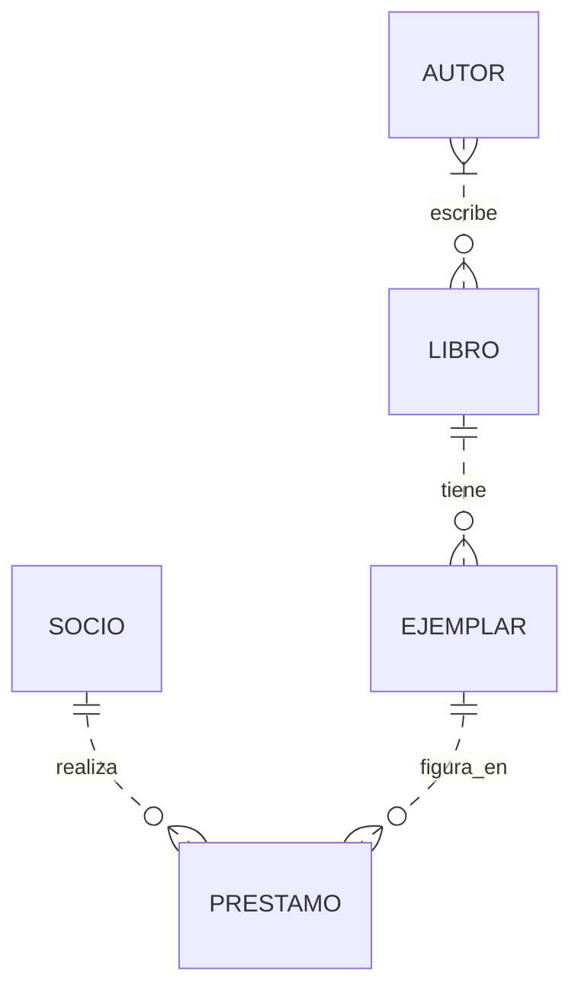

# Resumen. Modelo entidad/relación

**Bases de Datos · 1.º de DAM · Unidad 2**

El modelo entidad/relación permite describir qué información necesita un sistema, cómo se relaciona y qué reglas debe cumplir. Se construye antes de decidir cómo se crearán las tablas en un SGBD.

## Índice

- [1. Entidades y ocurrencias](#entidades)
- [2. Atributos y dominios](#atributos)
- [3. Identificadores](#identificadores)
- [4. Relaciones y cardinalidades](#relaciones)
- [5. Entidades débiles y asociativas](#dependencias)
- [6. Representación del modelo](#representacion)
- [7. Reglas de negocio](#reglas)
- [8. Ejemplo resuelto: biblioteca](#biblioteca)
- [9. Resumen](#resumen)

## 1. Entidades y ocurrencias

Una **entidad** representa un concepto relevante sobre el que necesitamos conservar información. Puede ser algo físico, como un ejemplar de un libro, o un hecho, como un préstamo.

| Concepto | Significado | Ejemplo |
|---|---|---|
| Tipo de entidad | Categoría que describimos en el modelo | SOCIO |
| Ocurrencia | Un caso concreto de esa categoría | El socio con código S01 |
| Atributo | Característica que lo describe | Nombre del socio |

En los diagramas dibujamos tipos de entidad. Por comodidad, habitualmente los llamamos simplemente «entidades».

> **Ejemplo:** en una biblioteca podemos identificar LIBRO, EJEMPLAR, AUTOR, SOCIO y PRESTAMO. No dibujamos un rectángulo por cada persona o por cada copia física.

Una entidad no es todavía una tabla. El modelo conceptual representa el problema; su transformación en tablas pertenece al diseño lógico.

## 2. Atributos y dominios

Los **atributos** describen propiedades de entidades o relaciones. Su **dominio** establece los valores admitidos y su significado.

Por ejemplo, para `numero_paginas` podemos definir «número entero positivo». Para `estado_prestamo`, podríamos acordar los valores «activo», «devuelto» y «cancelado».

### 2.1. Clasificación de los atributos

| Clasificación | Significado | Ejemplo |
|---|---|---|
| Simple | No interesa dividirlo en el modelo | Código de socio |
| Compuesto | Contiene partes que necesitamos distinguir | Dirección: calle, número y localidad |
| Monovaluado | Tiene como máximo un valor por ocurrencia | Fecha de nacimiento |
| Multivaluado | Puede tener varios valores por ocurrencia | Teléfonos de contacto |
| Almacenado | Su valor se conserva directamente | Fecha de nacimiento |
| Derivado | Se obtiene mediante un cálculo | Edad para una fecha determinada |
| Obligatorio | Debe tener un valor | Identificador de socio |
| Opcional | Puede no tener valor | Fecha de devolución de un préstamo activo |

Las clasificaciones se combinan. Un atributo puede ser simple, monovaluado y obligatorio a la vez.

«Simple» depende de lo que necesitemos representar: una fecha tiene día, mes y año, pero podemos tratarla como una unidad. Un atributo derivado tampoco se actualiza solo por dibujarlo: posteriormente habrá que implementar su cálculo.

### 2.2. ¿Atributo o entidad?

Si solo necesitamos guardar una característica, puede bastar un atributo. Si necesitamos gestionar sus propiedades y relaciones, puede convenir una entidad independiente.

> **Ejemplo:** si conservamos información propia de los autores, AUTOR será una entidad relacionada con LIBRO. No añadiremos además un atributo de texto `autor` que duplique esa misma información dentro de LIBRO.

### 2.3. Atributos de una relación

Un atributo pertenece a una relación cuando describe el vínculo entre sus participantes.

**Ejemplo:** si un alumno se matricula en una edición, la fecha de matrícula describe esa inscripción concreta. No describe al alumno ni a la edición por separado.

## 3. Identificadores

Un **identificador** es un atributo o conjunto mínimo de atributos que distingue inequívocamente cada ocurrencia.

| Concepto | Explicación | Ejemplo |
|---|---|---|
| Identificador simple | Un solo atributo | Código de socio |
| Identificador compuesto | Varios atributos necesarios conjuntamente | Hotel y número de habitación |
| Natural | Procede del dominio | Un código oficial, si cumple las condiciones del sistema |
| Artificial | Se crea para identificar | Código interno de préstamo |
| Clave candidata | Identificador mínimo posible | Código interno o código de catálogo, si ambos son únicos y obligatorios |
| Superclave | Identifica, aunque pueda incluir atributos innecesarios | Código de socio y nombre, cuando basta el código |

**Mínimo** significa que no podemos retirar un atributo sin perder la capacidad de identificar. No significa que tenga pocos caracteres.

Un identificador debe ser único y obligatorio; conviene que también sea estable. El nombre de una persona normalmente no cumple estas condiciones.

### 3.1. Identificador conceptual y claves del modelo relacional

En el diseño lógico relacional se seleccionará una **clave primaria** entre las candidatas. Una **clave foránea** será un conjunto de columnas que referencia una clave primaria o candidata con la unicidad requerida en otra tabla, o en la misma.

En el modelo conceptual de estos apuntes representamos las asociaciones mediante **relaciones**, sin copiar los identificadores de unas entidades como claves foráneas de otras.

> Para expresar quién realiza un préstamo, conectamos SOCIO y PRESTAMO. No necesitamos añadir `id_socio` dentro de PRESTAMO en este dibujo conceptual.

## 4. Relaciones y cardinalidades

Una **relación** representa una asociación entre ocurrencias. Se nombra habitualmente con un verbo: ESCRIBE, REALIZA, CONTIENE o PERTENECE.

Para resolver la cardinalidad hacemos dos preguntas:

1. Para una ocurrencia de A, ¿con cuántas de B puede relacionarse como mínimo y como máximo?
2. Para una ocurrencia de B, ¿con cuántas de A puede relacionarse como mínimo y como máximo?

| Pareja | Interpretación |
|---|---|
| `(0,1)` | Ninguna o una |
| `(1,1)` | Exactamente una |
| `(0,N)` | Ninguna, una o muchas |
| `(1,N)` | Una o muchas |

Los máximos permiten distinguir `1:1`, `1:N` y `N:M`. Los mínimos indican si la participación es opcional u obligatoria.

> **Ejemplo:** un socio puede tener cero o muchos préstamos a lo largo del tiempo. Cada préstamo pertenece exactamente a un socio. Es una relación `1:N`, con `(0,N)` préstamos por socio y `(1,1)` socios por préstamo.

Las cardinalidades dependen de las reglas, no del nombre de las entidades. Un libro puede tener varios autores; por tanto, no debemos asumir que AUTOR–LIBRO es `1:N` sin establecer expresamente esa limitación.

## 5. Entidades débiles y asociativas

Una **entidad débil por identificación** necesita el identificador de otra entidad para identificarse completamente.

Por ejemplo, una habitación puede identificarse por la combinación del hotel y su número dentro de él. El número es un identificador parcial.

Tener una relación obligatoria no convierte automáticamente a una entidad en débil. Si un préstamo tiene un identificador propio completo, no es débil por identificación aunque deba estar asociado a un socio.

Una **entidad asociativa** permite representar un vínculo con significado propio, especialmente si tiene atributos, debe relacionarse con otros conceptos o hay que distinguir varias ocurrencias del vínculo.

> Un préstamo con identificador y fechas permite distinguir que el mismo socio toma prestado el mismo ejemplar varias veces. Una simple relación SOCIO–EJEMPLAR no distinguiría por sí sola esas operaciones repetidas.

## 6. Representación del modelo

### 6.1. Notación de Chen

| Elemento | Símbolo habitual |
|---|---|
| Entidad | Rectángulo |
| Relación | Rombo |
| Atributo | Óvalo |
| Identificador elegido | Nombre del atributo subrayado |
| Atributo multivaluado | Óvalo doble |
| Atributo derivado | Óvalo discontinuo |
| Entidad débil | Rectángulo doble |
| Relación identificadora | Rombo doble |

En la convención mínimo-máximo empleada en clase, junto a cada entidad se indica cuántas veces participa una ocurrencia suya en la relación.

### 6.2. Pata de cuervo

Los diagramas Mermaid de estos materiales utilizan pata de cuervo. Sus marcas junto a una entidad indican cuántas ocurrencias de **esa entidad** corresponden a una del extremo contrario.

Por eso no debemos copiar la posición de los pares de Chen a pata de cuervo sin comprobar su lectura. Las tablas de cardinalidades explicitan siempre de qué entidad partimos y qué estamos contando.

## 7. Reglas de negocio

Las cardinalidades no expresan todas las condiciones del sistema. Algunas deben documentarse aparte.

| Regla | Por qué necesita una aclaración |
|---|---|
| Un ejemplar no puede tener dos préstamos activos simultáneamente | Puede tener muchos préstamos históricos; el límite depende del tiempo |
| La devolución no puede ser anterior al préstamo | Compara fechas |
| El delegado pertenece al grupo que representa | Relaciona la pertenencia con la delegación |

No hay que introducir restricciones por intuición. Por ejemplo, «un socio solo puede tener un préstamo activo» sería una política posible de una biblioteca, pero no una regla universal.

## 8. Ejemplo resuelto: biblioteca

### 8.1. Reglas del ejemplo

La biblioteca registra libros de su catálogo, sus autores y las copias físicas disponibles. Aquí LIBRO representa una publicación o edición bibliográfica concreta; EJEMPLAR representa una copia física de ella.

Adoptamos estas reglas:

- Cada libro tiene uno o varios autores identificados. Un autor puede registrarse antes de asociarlo a un libro.
- Un libro puede figurar en el catálogo sin ejemplares todavía. Cada ejemplar corresponde exactamente a un libro.
- Un socio puede no haber realizado préstamos o tener varios a lo largo del tiempo.
- Cada préstamo corresponde a un socio y a un ejemplar concretos.
- Un ejemplar puede tener muchos préstamos sucesivos, pero no dos activos a la vez.

Estas decisiones definen el alcance de este ejemplo. Una biblioteca que admita obras anónimas o préstamos de varios ejemplares en una sola operación necesitaría revisar el modelo.

### 8.2. Entidades, atributos e identificadores

| Entidad | Identificador | Otros atributos |
|---|---|---|
| LIBRO | `id_libro` | Título, ISBN, fecha de publicación, número de páginas |
| AUTOR | `id_autor` | Nombre |
| EJEMPLAR | `id_ejemplar` | Estado de conservación |
| SOCIO | `id_socio` | Nombre, correo, teléfono |
| PRESTAMO | `id_prestamo` | Fecha de préstamo, fecha límite, fecha de devolución |

El ISBN es un identificador bibliográfico, no el identificador de cada copia física. Por eso no sirve para distinguir varios ejemplares de la misma publicación. Usamos un código interno de libro y permitimos que el ISBN no esté disponible.

La fecha de devolución queda sin valor mientras el préstamo esté activo. Los identificadores no se copian a otras entidades: las conexiones se expresan mediante relaciones.

### 8.3. Cardinalidades

| Partimos de… | Contamos… | Mínimo y máximo |
|---|---|---|
| Un AUTOR | Sus LIBROS | `(0,N)` |
| Un LIBRO | Sus AUTORES | `(1,N)` |
| Un LIBRO | Sus EJEMPLARES | `(0,N)` |
| Un EJEMPLAR | Su LIBRO | `(1,1)` |
| Un SOCIO | Sus PRESTAMOS históricos | `(0,N)` |
| Un PRESTAMO | Su SOCIO | `(1,1)` |
| Un EJEMPLAR | Sus PRESTAMOS históricos | `(0,N)` |
| Un PRESTAMO | Su EJEMPLAR | `(1,1)` |

### 8.4. Diagrama

Cada entidad tiene identificador propio, por lo que se utilizan líneas no identificadoras. Los atributos están recogidos en la tabla anterior para facilitar la lectura.

### 8.5. Comprobación

| Situación | Resultado |
|---|---|
| Dos copias del mismo libro | Son dos EJEMPLARES asociados al mismo LIBRO |
| Un libro escrito por dos autores | Se admite mediante ESCRIBE, de tipo `N:M` |
| Un socio vuelve a llevarse el mismo ejemplar tras devolverlo | Se crea otra ocurrencia de PRESTAMO |
| Dos préstamos activos del mismo ejemplar | Incumple la regla temporal adicional |
| Un socio sin préstamos | Se admite porque su mínimo es cero |

## 9. Resumen

- Identificamos conceptos antes de pensar en tablas.
- Asignamos cada atributo a la entidad o relación que describe.
- Elegimos identificadores únicos, obligatorios y mínimos.
- Estudiamos mínimos y máximos en ambos sentidos.
- Diferenciamos dependencias de existencia y de identificación.
- Documentamos las reglas que no caben en el dibujo.
- Comprobamos el resultado con datos y situaciones concretas.

Para resolver enunciados seguimos la secuencia de la guía: marcar entidades y relaciones, redactar frases, construir modelos parciales, estudiar cardinalidades, reunir el modelo, incorporar atributos e identificadores y revisar.
