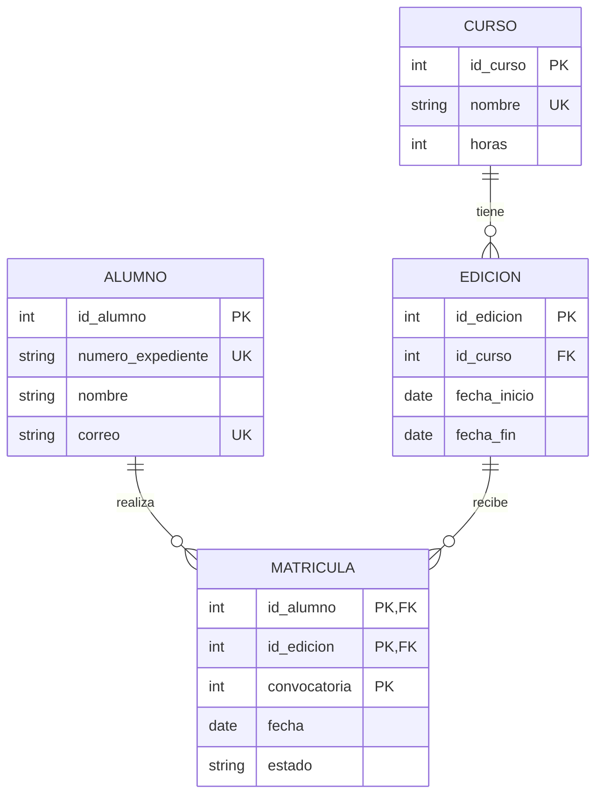

# Tema 3. El modelo relacional

> **Módulo:** Bases de Datos · **Curso:** 1.º DAM  
> Del diagrama conceptual a un esquema formado por relaciones, claves y restricciones.

## Objetivos de aprendizaje

Al finalizar este tema serás capaz de:

- explicar los fundamentos y elementos del modelo relacional;
- distinguir relación, esquema de relación, estado, tabla y resultado de consulta;
- identificar dominios, atributos, tuplas, grados y cardinalidades;
- reconocer superclaves, claves candidatas, primarias, alternativas y foráneas;
- aplicar integridad de dominio, de entidad, referencial y reglas de negocio;
- representar esquemas relacionales de forma textual y gráfica;
- transformar entidades, atributos y relaciones de un modelo E/R;
- transformar entidades débiles, relaciones recursivas y relaciones n-arias;
- elegir una estrategia para especializaciones y generalizaciones;
- interpretar las operaciones fundamentales del álgebra relacional;
- validar un esquema mediante datos de ejemplo y restricciones.

> [!NOTE]
> Este tema aborda el **modelo relacional y la transformación desde E/R**. Las dependencias funcionales, anomalías y formas normales se estudiarán en el **Tema 4: Normalización**.

---

## 1. Origen y propósito

El modelo relacional fue propuesto por Edgar F. Codd en 1970. Su idea central consiste en representar los datos mediante **relaciones** y manipularlos mediante operaciones con fundamento matemático.

Su éxito se debe, entre otros motivos, a que:

- utiliza una estructura lógica uniforme;
- separa la representación lógica de muchos detalles físicos;
- dispone de reglas de integridad;
- permite expresar consultas de forma declarativa;
- cuenta con una base formal: teoría de conjuntos y lógica de predicados.

En un lenguaje declarativo indicamos **qué** resultado queremos, no necesariamente el algoritmo exacto para obtenerlo. El SGBD puede estudiar distintas estrategias de ejecución.

### 1.1. Los tres diseños

Conviene situar este tema dentro del proceso completo:

| Nivel | Pregunta | Resultado orientativo |
|---|---|---|
| Conceptual | ¿Qué conceptos y reglas existen en el dominio? | Modelo E/R |
| Lógico | ¿Cómo se representan en el modelo relacional? | Relaciones, claves y restricciones |
| Físico | ¿Cómo se almacenarán y accederán en un SGBD concreto? | Índices, particiones y parámetros |

Una clave foránea pertenece al diseño lógico. Un índice es una decisión principalmente física. No deben introducirse ambos prematuramente en el diagrama conceptual.

---

## 2. Qué es una relación

Formalmente, una relación sobre los dominios $D_1, D_2, \ldots, D_n$ es un subconjunto del producto cartesiano:

$$
r \subseteq D_1 \times D_2 \times \cdots \times D_n
$$

En la práctica trabajamos con atributos con nombre. Un **esquema de relación** se escribe así:

```text
ALUMNO(id_alumno, nombre, correo, fecha_nacimiento)
```

- `ALUMNO` es el nombre de la relación.
- Los elementos entre paréntesis son sus atributos.
- Cada atributo posee un dominio.

Un **estado de relación** es el conjunto de tuplas existentes en un momento determinado.

| id_alumno | nombre | correo | fecha_nacimiento |
|---:|---|---|---|
| 101 | Ana Torres | ana@example.test | 2007-04-12 |
| 102 | Luis Díaz | luis@example.test | 2006-11-03 |

El esquema cambia pocas veces; el estado cambia al insertar, modificar o eliminar datos.

### 2.1. Relación frente a tabla SQL

Es habitual utilizar «relación» y «tabla» como aproximaciones, pero no son idénticas:

- una relación matemática es un conjunto y no contiene tuplas duplicadas;
- las tuplas y atributos no tienen un orden significativo;
- una tabla SQL puede mostrar filas ordenadas solo si una consulta solicita un orden;
- SQL puede producir duplicados en determinados resultados si no se eliminan;
- SQL incorpora `NULL`, cuyo comportamiento requiere una lógica de tres valores.

> [!IMPORTANT]
> El orden visual de las filas o columnas no forma parte del significado lógico de una relación. Nunca debemos confiar en el «orden en que se guardaron» los registros.

---

## 3. Elementos del modelo relacional

### 3.1. Atributo

Un **atributo** es una propiedad con nombre dentro de una relación. Dentro de la misma relación no debe haber dos atributos con el mismo nombre.

### 3.2. Dominio

Un **dominio** describe el conjunto de valores válidos de uno o varios atributos. No es solamente un tipo técnico: puede incorporar significado y restricciones.

Ejemplos:

- `PORCENTAJE`: número decimal entre 0 y 100;
- `CORREO`: cadena con el formato y longitud acordados;
- `ESTADO_MATRICULA`: `pendiente`, `activa`, `anulada` o `finalizada`;
- `FECHA_NACIMIENTO`: fecha válida no posterior al día actual.

Dos atributos pueden usar el mismo tipo físico y pertenecer a dominios semánticos distintos. Un `id_alumno` y un `numero_aula` podrían ser enteros, pero no representan valores intercambiables.

### 3.3. Tupla

Una **tupla** asigna un valor de su dominio a cada atributo. Representa un hecho conforme al significado de la relación.

### 3.4. Grado y cardinalidad

- **Grado o aridad:** número de atributos de una relación.
- **Cardinalidad:** número de tuplas de su estado actual.

Para la tabla anterior, el grado es 4 y la cardinalidad es 2. No debemos confundir esta cardinalidad con la cardinalidad de una relación del modelo E/R.

### 3.5. Valor nulo

`NULL` representa ausencia de valor, pero puede corresponder a situaciones diferentes:

- desconocido;
- todavía no disponible;
- no aplicable;
- no registrado.

`NULL` no equivale a cero, cadena vacía ni `false`. Su comparación tampoco funciona como la de un valor ordinario.

Reducir nulos innecesarios mejora la claridad, pero prohibirlos de forma mecánica puede complicar el diseño. La opcionalidad debe proceder de las reglas de negocio.

---

## 4. Propiedades de las relaciones

En el modelo relacional formal:

- cada relación tiene un nombre único dentro de su esquema;
- cada atributo tiene un nombre distinto dentro de la relación;
- cada valor pertenece al dominio del atributo;
- cada intersección entre tupla y atributo contiene un único valor;
- no existen tuplas duplicadas;
- el orden de tuplas y atributos no aporta significado.

La condición de un valor por celda se relaciona con la primera forma normal, que se estudiará con más precisión en el Tema 4.

### 4.1. Esquema de base de datos

Un **esquema relacional de base de datos** incluye:

- esquemas de relación;
- dominios;
- claves;
- referencias;
- restricciones adicionales.

Ejemplo textual:

```text
CURSO(
  id_curso PK,
  nombre AK,
  horas
)

EDICION(
  id_edicion PK,
  id_curso FK -> CURSO(id_curso) NOT NULL,
  fecha_inicio,
  fecha_fin,
  CHECK fecha_fin >= fecha_inicio
)
```

`PK`, `AK`, `FK`, `NOT NULL` y `CHECK` son abreviaturas documentales. Todavía no constituyen necesariamente código SQL ejecutable.

---

## 5. Claves

### 5.1. Superclave

Una **superclave** es cualquier conjunto de atributos que identifica de forma única una tupla.

Si `id_alumno` es único, `{id_alumno}` y `{id_alumno, nombre}` son superclaves. La segunda contiene un atributo innecesario.

### 5.2. Clave candidata

Una **clave candidata** es una superclave mínima: si eliminamos cualquiera de sus atributos deja de garantizar la unicidad.

Puede ser:

- **simple**, con un atributo;
- **compuesta**, con varios atributos.

### 5.3. Clave primaria y alternativas

- **Clave primaria (PK):** candidata elegida para identificar las tuplas.
- **Clave alternativa (AK):** candidata no elegida como primaria.

La primaria debe ser única, mínima, obligatoria y estable. Las alternativas también necesitan una restricción de unicidad si deben seguir identificando.

### 5.4. Clave natural y artificial

- **Natural:** tiene significado en el dominio, como un código estable asignado por una organización.
- **Artificial o sustituta:** se crea para la base de datos, como `id_alumno`.

Una clave artificial simplifica referencias, pero no sustituye las restricciones de unicidad del dominio. Si el correo no se puede repetir, añadir `id_alumno` no elimina la necesidad de declarar `UNIQUE(correo)`.

### 5.5. Clave foránea

Una **clave foránea (FK)** es un conjunto de atributos de una relación cuyos valores deben:

- coincidir con una clave candidata referenciada de otra relación —o de la misma—, o
- ser nulos cuando la relación sea opcional y la restricción lo permita.

La clave referenciada suele ser la primaria, pero también puede ser una clave alternativa declarada única.

Una clave foránea:

- puede ser simple o compuesta;
- puede formar parte de la clave primaria de su propia relación;
- no tiene que ser única;
- puede ser autorreferente;
- debe usar dominios compatibles con la clave referenciada.

---

## 6. Restricciones de integridad

Las restricciones determinan qué estados de la base de datos son válidos.

### 6.1. Integridad de dominio

Cada atributo debe contener valores admitidos por su dominio: tipo, rango, formato, conjunto permitido y opcionalidad.

### 6.2. Integridad de clave

No pueden existir dos tuplas con el mismo valor para una clave candidata.

### 6.3. Integridad de entidad

Ningún atributo que forme parte de la clave primaria puede ser `NULL`.

### 6.4. Integridad referencial

Cada clave foránea no nula debe referenciar una tupla existente mediante la clave candidata indicada.

Ejemplo: una edición no puede guardar un `id_curso` inexistente.

### 6.5. Restricciones semánticas

Representan reglas particulares del dominio:

- `horas > 0`;
- `fecha_fin >= fecha_inicio`;
- máximo 30 matrículas activas por edición;
- un docente no puede evaluarse a sí mismo;
- una edición cancelada no admite nuevas matrículas.

Según su complejidad podrán implementarse mediante restricciones declarativas, transacciones, disparadores o lógica de aplicación. La decisión técnica se estudiará en temas posteriores, pero la regla debe documentarse desde ahora.

### 6.6. Acciones ante cambios referenciados

Si una clave referenciada se modifica o su tupla se elimina, el diseño debe decidir una política:

- rechazar la operación;
- propagar el cambio;
- asignar `NULL`, si la participación es opcional;
- asignar un valor predeterminado válido.

No existe una acción universalmente correcta. El borrado en cascada puede ser útil para elementos dependientes y peligroso para información histórica.

---

## 7. Representación de un esquema

### 7.1. Notación textual

```text
ALUMNO(id_alumno PK, numero_expediente AK, nombre, correo AK)

EDICION(id_edicion PK, id_curso FK -> CURSO(id_curso), fecha_inicio, fecha_fin)

MATRICULA(
  id_alumno PK FK -> ALUMNO(id_alumno),
  id_edicion PK FK -> EDICION(id_edicion),
  convocatoria PK,
  fecha,
  estado
)
```

En `MATRICULA`, la clave primaria está compuesta por tres atributos. No hay tres claves primarias.

### 7.2. Diagrama relacional



Mermaid utiliza `UK` para mostrar unicidad. En otros documentos podemos emplear `AK` para clave alternativa. Debe añadirse una leyenda cuando la herramienta y la terminología no coincidan.

---

## 8. Transformación del modelo E/R

Transformar no significa copiar rectángulos como tablas sin analizar restricciones. Cada decisión debe conservar el significado del modelo conceptual.

### 8.1. Entidad fuerte

Por cada tipo de entidad fuerte creamos una relación:

1. incorporamos sus atributos simples;
2. descomponemos los atributos compuestos en sus componentes necesarios;
3. elegimos una clave candidata como primaria;
4. conservamos las demás candidatas como alternativas únicas;
5. tratamos por separado atributos multivaluados y derivados.

Ejemplo conceptual:

```text
CURSO: id_curso, nombre, duración(horas, unidad), etiquetas{...}
```

Transformación inicial:

```text
CURSO(id_curso PK, nombre AK, duracion_horas)
CURSO_ETIQUETA(id_curso PK FK -> CURSO, etiqueta PK)
```

Si la unidad siempre es hora, no hace falta almacenarla en cada fila. Un atributo derivado se omite normalmente si puede calcularse de forma fiable.

### 8.2. Atributo multivaluado

Creamos una relación que contiene:

- la clave de la entidad propietaria como FK;
- el valor del atributo;
- atributos adicionales del valor, si existen.

La combinación del propietario y el valor puede ser la clave primaria, salvo que el dominio requiera otro identificador.

```text
ALUMNO_TELEFONO(
  id_alumno PK FK -> ALUMNO(id_alumno),
  telefono PK,
  tipo,
  es_preferente
)
```

### 8.3. Entidad débil

Creamos una relación con:

- sus atributos;
- la clave primaria de la entidad propietaria como FK;
- una PK formada normalmente por la clave de la propietaria y el identificador parcial.

```text
HOTEL(id_hotel PK, nombre)
HABITACION(
  id_hotel PK FK -> HOTEL(id_hotel),
  numero PK,
  capacidad
)
```

La relación identificadora no necesita una tabla separada salvo que posea propiedades o reglas adicionales que lo justifiquen.

---

## 9. Transformación de relaciones binarias

### 9.1. Relación `1:N`

La regla habitual es propagar la PK del lado `1` a la relación del lado `N` como FK.

Modelo conceptual:

> Cada edición pertenece exactamente a un curso. Un curso puede tener ninguna o muchas ediciones.

```text
CURSO(id_curso PK, nombre)
EDICION(id_edicion PK, id_curso FK -> CURSO NOT NULL, fecha_inicio)
```

La FK está en `EDICION` porque cada edición se relaciona como máximo con un curso. Es `NOT NULL` porque la participación de `EDICION` es obligatoria.

Si la participación del lado `N` fuera opcional, la FK podría admitir `NULL`. Crear una relación adicional solo para evitar todo nulo no es una regla general.

Los atributos de la relación se incorporan normalmente al lado `N`, porque cada tupla de ese lado participa como máximo una vez.

### 9.2. Relación `N:M`

Creamos una nueva relación con:

- las claves de las entidades participantes como FKs;
- los atributos de la relación;
- una clave primaria que refleje la unicidad del vínculo.

```text
ALUMNO(id_alumno PK, nombre)
EDICION(id_edicion PK, fecha_inicio)
MATRICULA(
  id_alumno PK FK -> ALUMNO,
  id_edicion PK FK -> EDICION,
  fecha,
  estado
)
```

Si el mismo alumno puede matricularse varias veces en la misma edición —por ejemplo, una vez por convocatoria— la PK anterior es insuficiente:

```text
PK(id_alumno, id_edicion, convocatoria)
```

La clave no se decide por una receta visual: debe expresar qué hechos pueden repetirse según el dominio.

### 9.3. Relación `1:1`

Existen varias estrategias.

#### Estrategia A: propagar una clave

Se incorpora la PK de una entidad como FK en la otra y se añade `UNIQUE` para conservar el máximo uno.

```text
PERSONA(id_persona PK, nombre)
PASAPORTE(
  numero_pasaporte PK,
  id_persona FK -> PERSONA UNIQUE NOT NULL,
  fecha_caducidad
)
```

Esta opción es adecuada si todo pasaporte pertenece a una persona y no toda persona tiene pasaporte. Colocar la FK en `PASAPORTE` evita nulos y refleja su dependencia.

#### Estrategia B: fusionar relaciones

Puede ser razonable cuando ambas entidades comparten ciclo de vida, ambas participaciones son obligatorias y la separación no aporta valor. Debemos comprobar que no estemos ocultando conceptos distintos.

#### Estrategia C: crear una relación para el vínculo

Puede utilizarse si:

- ambas participaciones son opcionales;
- el vínculo tiene propiedades o historia propia;
- otras relaciones necesitan referirse al vínculo.

Hay que declarar unicidad sobre ambas FKs para mantener el `1:1`.

> [!WARNING]
> Una FK por sí sola representa normalmente un máximo `N` desde el lado referenciado. Para representar `1:1` es necesaria una restricción `UNIQUE` sobre la FK.

---

## 10. Relaciones recursivas

### 10.1. Recursiva `1:N`

La relación se representa con una FK autorreferente y nombres que expresen los roles.

```text
EMPLEADO(
  id_empleado PK,
  nombre,
  id_supervisor FK -> EMPLEADO(id_empleado) NULL
)
```

`id_supervisor` puede ser nulo para una persona sin supervisor. Una regla adicional podría impedir que un empleado se supervise a sí mismo.

### 10.2. Recursiva `N:M`

Se crea una relación independiente con dos FKs hacia la misma relación, diferenciadas por sus roles.

```text
PRERREQUISITO(
  id_modulo PK FK -> MODULO(id_modulo),
  id_modulo_requerido PK FK -> MODULO(id_modulo)
)
```

Pueden ser necesarias reglas para impedir autorreferencias o ciclos.

### 10.3. Recursiva `1:1`

Puede usarse una FK autorreferente con `UNIQUE`. Debemos estudiar si el vínculo es simétrico: «ser pareja de» no se comporta igual que «ser responsable de» y puede requerir controles adicionales.

---

## 11. Relaciones n-arias

Una relación ternaria se transforma normalmente en una nueva relación con FKs a cada participante y con los atributos del vínculo.

Ejemplo:

> Un proveedor suministra un producto para un proyecto a un precio acordado.

```text
SUMINISTRO(
  id_proveedor FK -> PROVEEDOR,
  id_producto FK -> PRODUCTO,
  id_proyecto FK -> PROYECTO,
  precio_acordado,
  PRIMARY KEY(id_proveedor, id_producto, id_proyecto)
)
```

La cardinalidad conceptual puede permitir una clave menor. Si para cada pareja `(producto, proyecto)` existe como máximo un proveedor, esa pareja podría ser la PK y `id_proveedor` quedaría fuera de ella.

> [!IMPORTANT]
> No se debe convertir automáticamente una relación ternaria en tres binarias. Podríamos admitir combinaciones que nunca existieron juntas o perder atributos cuyo significado depende de los tres participantes.

---

## 12. Especialización y generalización

No existe una única transformación correcta para todas las jerarquías. La estrategia depende de:

- especialización total o parcial;
- disjunta o solapada;
- cantidad de atributos comunes y específicos;
- consultas frecuentes;
- restricciones que necesitamos garantizar.

Supongamos:

- `PERSONA(id_persona, nombre, correo)`;
- `ALUMNO(numero_expediente)`;
- `DOCENTE(especialidad)`.

### 12.1. Tabla para la superclase y cada subclase

```text
PERSONA(id_persona PK, nombre, correo AK)
ALUMNO(id_persona PK FK -> PERSONA, numero_expediente AK)
DOCENTE(id_persona PK FK -> PERSONA, especialidad)
```

Ventajas:

- evita repetir atributos comunes;
- representa especializaciones parciales y solapadas;
- conserva claramente la identidad compartida.

Coste: consultar una subclase completa requiere combinar relaciones.

### 12.2. Una sola tabla para toda la jerarquía

```text
PERSONA(
  id_persona PK,
  nombre,
  correo AK,
  tipo,
  numero_expediente NULL,
  especialidad NULL
)
```

Puede resultar sencilla para una jerarquía total y disjunta, pero introduce columnas no aplicables y restricciones condicionales. Un único discriminador no representa bien subclases solapadas.

### 12.3. Una tabla por subclase concreta

```text
ALUMNO(id_persona PK, nombre, correo, numero_expediente)
DOCENTE(id_persona PK, nombre, correo, especialidad)
```

Evita combinaciones para consultar una subclase, pero duplica atributos comunes y dificulta una identidad global. Encaja mejor en determinadas jerarquías totales y disjuntas.

La estrategia se elige y documenta; no se memoriza como una regla absoluta.

---

## 13. Agregación y entidades asociativas

Una agregación conceptual suele transformarse dando identidad a la asociación.

Ejemplo:

```text
ASIGNACION(
  id_asignacion PK,
  id_empleado FK -> EMPLEADO,
  id_proyecto FK -> PROYECTO,
  fecha_inicio,
  dedicacion
)

SUPERVISION(
  id_asignacion PK FK -> ASIGNACION,
  id_responsable FK -> RESPONSABLE,
  fecha_revision
)
```

Una clave artificial para `ASIGNACION` puede facilitar que otras relaciones la referencien. Aun así, debemos mantener una restricción de unicidad natural si el dominio prohíbe asignaciones duplicadas.

---

## 14. Comprobación de mínimos y máximos

Las FKs representan bien muchas restricciones máximas y algunas mínimas, pero no todas.

### 14.1. Lo que puede expresar una FK

```text
EDICION.id_curso FK NOT NULL
```

Expresa que cada edición pertenece exactamente a un curso existente.

### 14.2. Lo que no expresa por sí sola

No garantiza que todo curso tenga al menos una edición. Esa regla afecta al número de filas de otra relación y requiere una estrategia adicional.

Igualmente, una tabla `MATRICULA` garantiza que cada matrícula referencia un alumno y una edición, pero no que toda edición tenga al menos un alumno.

Para cada transformación debemos construir una tabla de conservación de restricciones:

| Regla conceptual | Elemento relacional | ¿Queda garantizada? |
|---|---|---|
| Cada edición pertenece a un curso | FK `EDICION.id_curso NOT NULL` | Sí |
| Un curso puede tener muchas ediciones | FK no única | Sí |
| Todo curso debe tener alguna edición | Solo FK | No |
| Un alumno no repite edición y convocatoria | PK/UNIQUE compuesta | Sí |

---

## 15. Introducción al álgebra relacional

El álgebra relacional define operaciones que reciben una o más relaciones y producen otra relación. Esta propiedad se denomina **clausura** y permite combinar operaciones.

Usaremos:

```text
ALUMNO(id_alumno, nombre, municipio)
MATRICULA(id_alumno, id_edicion, estado)
EDICION(id_edicion, id_curso, fecha_inicio)
```

### 15.1. Selección $\sigma$

Filtra tuplas que cumplen una condición:

$$
\sigma_{municipio = 'Arrecife'}(ALUMNO)
$$

La selección reduce filas, no columnas.

### 15.2. Proyección $\pi$

Selecciona atributos:

$$
\pi_{nombre, municipio}(ALUMNO)
$$

En el álgebra relacional clásica, el resultado elimina tuplas duplicadas porque es un conjunto.

### 15.3. Renombrado $\rho$

Cambia el nombre de una relación o sus atributos, algo especialmente útil en autorrelaciones:

$$
\rho_{A(id, nombre, municipio)}(ALUMNO)
$$

### 15.4. Unión $\cup$

Reúne tuplas de dos relaciones compatibles:

$$
R \cup S
$$

Las relaciones deben ser compatibles para la unión: mismo grado y dominios correspondientes compatibles.

### 15.5. Diferencia $-$

Devuelve las tuplas de `R` que no están en `S`:

$$
R - S
$$

También requiere compatibilidad para la unión.

### 15.6. Intersección $\cap$

Devuelve las tuplas comunes:

$$
R \cap S
$$

Puede definirse mediante diferencia y no siempre se considera operador primitivo.

### 15.7. Producto cartesiano $\times$

Combina cada tupla de una relación con cada tupla de otra:

$$
ALUMNO \times EDICION
$$

Si hay 100 alumnos y 5 ediciones, produce 500 combinaciones antes de aplicar restricciones. Normalmente se utiliza como base formal para otras operaciones, no como resultado final útil.

### 15.8. Combinación o join $\bowtie$

Relaciona tuplas mediante una condición:

$$
ALUMNO \bowtie_{ALUMNO.id\_alumno = MATRICULA.id\_alumno} MATRICULA
$$

La combinación natural utiliza automáticamente atributos con el mismo nombre, por lo que exige especial atención a la semántica y los nombres.

### 15.9. División $\div$

Resuelve consultas del tipo «todos»:

> Obtener el alumnado matriculado en **todas** las ediciones de un conjunto determinado.

Es una operación menos intuitiva, pero ayuda a reconocer consultas universales.

### 15.10. Composición de operaciones

Nombres del alumnado con matrícula activa:

$$
\pi_{nombre}
\left(
ALUMNO \bowtie
\sigma_{estado='activa'}(MATRICULA)
\right)
$$

Más adelante traduciremos este razonamiento a SQL.

---

## 16. Ejemplo integrado: academia

### 16.1. Modelo conceptual resumido

- Un curso puede ofrecer varias ediciones.
- Cada edición pertenece a un curso.
- Alumnos y docentes son personas.
- Una persona puede ser alumno, docente o ambas cosas.
- Un alumno se matricula en una edición y puede repetir por convocatoria.
- Uno o más docentes imparten cada edición.

### 16.2. Esquema relacional propuesto

```text
PERSONA(
  id_persona PK,
  nombre,
  correo AK
)

ALUMNO(
  id_persona PK FK -> PERSONA(id_persona),
  numero_expediente AK
)

DOCENTE(
  id_persona PK FK -> PERSONA(id_persona),
  especialidad
)

CURSO(
  id_curso PK,
  nombre AK,
  horas
)

EDICION(
  id_edicion PK,
  id_curso FK -> CURSO(id_curso) NOT NULL,
  fecha_inicio,
  fecha_fin,
  CHECK fecha_fin >= fecha_inicio
)

MATRICULA(
  id_alumno PK FK -> ALUMNO(id_persona),
  id_edicion PK FK -> EDICION(id_edicion),
  convocatoria PK,
  fecha NOT NULL,
  estado NOT NULL
)

IMPARTE(
  id_docente PK FK -> DOCENTE(id_persona),
  id_edicion PK FK -> EDICION(id_edicion),
  rol
)
```

### 16.3. Decisiones justificadas

- Se utiliza una tabla para la superclase y cada subclase porque la especialización es parcial y solapada.
- `EDICION.id_curso` no admite nulos porque toda edición pertenece a un curso.
- `MATRICULA` incluye `convocatoria` en su PK porque se permite repetir el vínculo.
- `IMPARTE` transforma una relación `N:M` y conserva el atributo `rol`.
- `correo` y `numero_expediente` son claves alternativas y deben ser únicos.
- La regla «cada edición debe tener al menos un docente» no queda garantizada solo por `IMPARTE`; debe documentarse e implementarse de otra forma.

---

## 17. Método para transformar un modelo

1. **Validar el modelo conceptual.** No transformar un diagrama ambiguo.
2. **Enumerar entidades, identificadores y dominios.**
3. **Transformar entidades fuertes.**
4. **Transformar atributos compuestos y multivaluados.**
5. **Transformar entidades débiles.**
6. **Transformar relaciones binarias.**
7. **Transformar relaciones recursivas y n-arias.**
8. **Elegir estrategias para jerarquías y agregaciones.**
9. **Declarar claves candidatas y referencias.**
10. **Traducir participación a `NULL`/`NOT NULL`, `UNIQUE` y otras restricciones.**
11. **Documentar las reglas que no han quedado expresadas.**
12. **Validar con datos normales, límites y casos inválidos.**

---

## 18. Errores frecuentes

### Confundir relación y tabla visual

Una relación no tiene orden ni duplicados; una presentación o resultado SQL puede comportarse de otra manera.

### Decir que una relación es solo su estructura

La estructura es el **esquema de relación**. La relación o estado incluye las tuplas existentes en un momento.

### Elegir como PK cualquier atributo único en los datos de prueba

Que hoy no haya nombres repetidos no demuestra una restricción permanente.

### Suponer que una FK siempre referencia la PK

Puede referenciar otra clave candidata declarada única.

### Olvidar `UNIQUE` en una relación `1:1`

La FK sin unicidad permite que varias filas apunten a la misma ocurrencia.

### Prohibir todos los nulos

La nulabilidad debe reflejar opcionalidad y significado, no una preferencia estética.

### Confundir clave compuesta con varias claves primarias

Una tabla tiene una PK, aunque esté formada por varios atributos.

### Descomponer una relación ternaria sin verificar equivalencia

Puede perderse el significado de la combinación completa.

### Crear claves artificiales y olvidar las reglas naturales

Un `id` nuevo no impide duplicados del dominio si no se declaran claves alternativas.

### Confiar en la FK para garantizar todos los mínimos

Una FK desde `EDICION` a `CURSO` no garantiza que todo curso tenga ediciones.

### Añadir índices al esquema lógico como si fueran claves

Una clave expresa identidad o integridad; un índice es una estructura de acceso. Un SGBD puede usar índices para implementar restricciones, pero los conceptos no son equivalentes.

---

## 19. Lista de comprobación

### Relaciones y dominios

- [ ] Cada relación tiene nombre y significado claros.
- [ ] Cada atributo pertenece a un dominio definido.
- [ ] No se confía en el orden físico de filas o columnas.
- [ ] Los atributos multivaluados tienen una relación propia.

### Claves

- [ ] Cada relación tiene al menos una clave candidata.
- [ ] La PK es mínima, estable y obligatoria.
- [ ] Las claves alternativas conservan su unicidad.
- [ ] Las claves compuestas contienen todos y solo los atributos necesarios.
- [ ] Las FKs referencian claves candidatas y usan dominios compatibles.

### Restricciones

- [ ] La nulabilidad refleja la participación mínima.
- [ ] Las relaciones `1:1` incluyen la unicidad necesaria.
- [ ] Las reglas de rango y coherencia están documentadas.
- [ ] Se ha decidido qué ocurre al modificar o eliminar referencias.
- [ ] Las restricciones no expresables directamente están catalogadas.

### Transformación

- [ ] Se han tratado entidades débiles y atributos multivaluados.
- [ ] Las relaciones `1:N`, `N:M` y `1:1` conservan sus cardinalidades.
- [ ] Los roles recursivos tienen nombres diferentes.
- [ ] Las relaciones n-arias no se han descompuesto sin prueba.
- [ ] La estrategia de las jerarquías está justificada.
- [ ] Se han probado casos válidos e inválidos.

---

## 20. Actividades de autoevaluación

1. Diferencia esquema de relación, estado de relación y tabla SQL.
2. Calcula grado y cardinalidad de una relación de ejemplo.
3. Enumera las superclaves de una relación pequeña y localiza las candidatas.
4. Propón una PK natural y otra artificial; compara sus compromisos.
5. Explica cuándo una FK puede ser nula.
6. Transforma un atributo multivaluado con propiedades propias.
7. Transforma una entidad débil y justifica su PK.
8. Transforma relaciones `1:N`, `N:M` y `1:1` indicando nulabilidad y unicidad.
9. Modela una relación recursiva con roles y una regla contra autorreferencias.
10. Demuestra con datos por qué una relación ternaria no siempre equivale a tres binarias.
11. Compara las tres estrategias de transformación de una jerarquía.
12. Indica qué restricciones mínimas del caso de la academia no garantizan las FKs.
13. Expresa mediante álgebra relacional el alumnado de un municipio determinado.
14. Expresa los nombres del alumnado con matrícula activa.
15. Revisa un esquema propio mediante la lista de comprobación.

---

## 21. Glosario

| Término | Definición breve |
|---|---|
| Álgebra relacional | Conjunto de operaciones formales sobre relaciones. |
| Atributo | Propiedad con nombre dentro de una relación. |
| Cardinalidad | Número de tuplas de un estado de relación. |
| Clave alternativa | Clave candidata no elegida como primaria. |
| Clave candidata | Superclave mínima. |
| Clave foránea | Atributos que referencian una clave candidata de una relación. |
| Clave primaria | Clave candidata elegida como identificador principal. |
| Dominio | Conjunto y significado de los valores admitidos por un atributo. |
| Esquema de relación | Nombre de una relación, atributos, dominios y restricciones. |
| Grado | Número de atributos de una relación. |
| Integridad de entidad | La PK es única y ninguno de sus atributos es nulo. |
| Integridad referencial | Toda FK no nula referencia una clave existente. |
| `NULL` | Marcador de ausencia de valor; no es un valor ordinario. |
| Relación | Conjunto de tuplas definido sobre atributos y dominios. |
| Tupla | Asignación de valores a los atributos de una relación. |

---

## Referencias

- [Real Decreto 405/2023: currículo básico actualizado del módulo Bases de Datos (0484)](https://www.boe.es/diario_boe/txt.php?id=BOE-A-2023-13221).
- Codd, E. F. (1970). *A Relational Model of Data for Large Shared Data Banks*. Communications of the ACM, 13(6), 377-387.

> En los diagramas y esquemas de clase se utilizará una leyenda coherente para `PK`, `AK` o `UK`, `FK`, nulabilidad y restricciones. El significado prevalece sobre el estilo gráfico de una herramienta concreta.