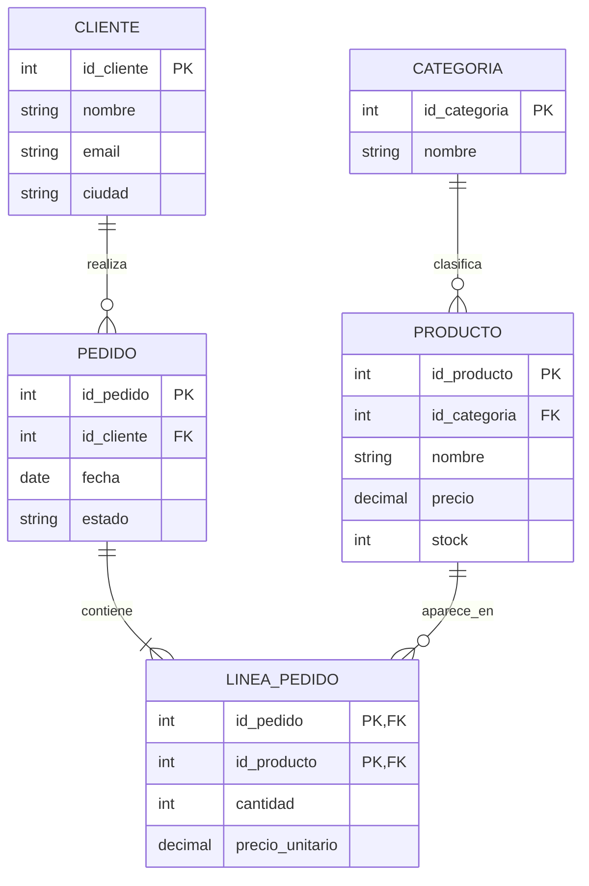

# Tema 5. Consultas SQL 🔎

> **Módulo:** Bases de Datos · **Curso:** 1.º DAM  
> Aprenderemos a convertir preguntas sobre los datos en consultas correctas, legibles y eficientes.

## Resultado de aprendizaje

Este tema desarrolla la consulta de información almacenada mediante SQL: consultas simples, combinaciones internas y externas, resúmenes, subconsultas, operaciones de conjuntos y criterios básicos de optimización.

## Bloques

1. [Fundamentos de `SELECT`](01-fundamentos-select.md)
2. [Filtrado, expresiones y funciones](02-filtrado-y-funciones.md)
3. [Agregación y agrupamiento](03-agregacion-y-agrupamiento.md)
4. [Consultas multitabla](04-consultas-multitabla.md)
5. [Subconsultas y operaciones de conjuntos](05-subconsultas-y-conjuntos.md)
6. [Consultas avanzadas y optimización](06-avanzadas-y-optimizacion.md)
7. [Patrones y expresiones regulares](07-patrones-y-expresiones-regulares.md)
8. [Chuleta de consulta rápida](chuleta.md)

## Alcance y dialecto

Utilizaremos **SQL estándar** como referencia conceptual y **SQLite** para ejecutar los ejemplos. Las diferencias se marcarán expresamente:

- `LIMIT` y `OFFSET` son habituales, pero no forman parte de la sintaxis estándar de todos los SGBD.
- `GLOB` es propio de SQLite.
- SQLite reconoce `REGEXP` como operador, pero necesita que la aplicación o una extensión proporcione la función correspondiente.
- Las funciones de fecha, concatenación y conversión varían entre productos.

> [!IMPORTANT]
> En este tema consultamos datos. `INSERT`, `UPDATE`, `DELETE` y las transacciones se estudiarán en el Tema 6.

## Base de datos de ejemplo

Los bloques utilizan una tienda sencilla:



Esquema abreviado:

```text
CLIENTE(id_cliente PK, nombre, email AK, ciudad)
CATEGORIA(id_categoria PK, nombre AK)
PRODUCTO(id_producto PK, id_categoria FK, nombre, precio, stock)
PEDIDO(id_pedido PK, id_cliente FK, fecha, estado)
LINEA_PEDIDO(id_pedido PK/FK, id_producto PK/FK, cantidad, precio_unitario)
```

## Cómo estudiar el tema

Para cada consulta:

1. escribe la pregunta con palabras;
2. identifica las filas de partida;
3. decide qué tablas necesitas;
4. establece cómo se relacionan;
5. filtra las filas;
6. agrupa, si procede;
7. selecciona las columnas finales;
8. ordena y limita solo al final;
9. comprueba casos límite y valores nulos;
10. revisa el plan de ejecución si el volumen importa.

## Criterios de calidad

Una consulta correcta debe ser:

- **correcta:** responde exactamente a la pregunta;
- **completa:** contempla nulos, duplicados y ausencia de datos;
- **legible:** usa formato, alias y nombres claros;
- **determinista cuando sea necesario:** no depende de un orden implícito;
- **eficiente:** evita trabajo innecesario y permite aprovechar índices;
- **verificable:** puede probarse con datos que incluyan casos límite.

## Referencias oficiales

- [SQLite: sentencia SELECT](https://www.sqlite.org/lang_select.html)
- [SQLite: expresiones](https://www.sqlite.org/lang_expr.html)
- [SQLite: funciones incorporadas](https://www.sqlite.org/lang_corefunc.html)
- [SQLite: funciones de ventana](https://www.sqlite.org/windowfunctions.html)
- [SQLite: planificación de consultas](https://www.sqlite.org/queryplanner.html)

